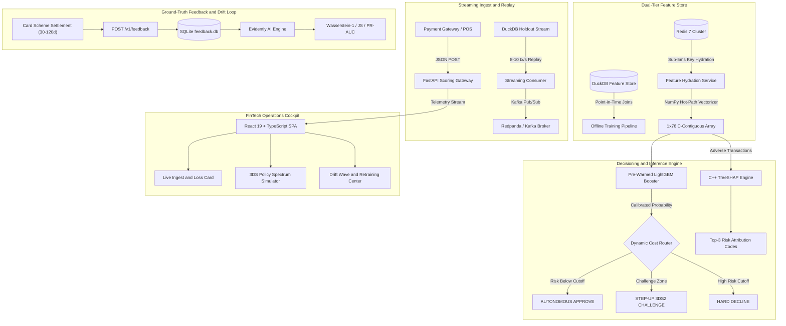

<div align="center">

# Real-Time Transaction Fraud Decisioning Engine
### Dual-Tier Feature Store • Dynamic Cost Router • Conformal Risk Control • Sub-25ms p95 SLA

[](https://www.python.org/)
[](https://fastapi.tiangolo.com/)
[](https://lightgbm.readthedocs.io/)
[](https://duckdb.org/)
[](https://redis.io/)
[](https://redpanda.com/)
[](https://react.dev/)
[](https://www.docker.com/)
[](LICENSE)

*A production-grade, low-latency payment risk decisioning platform trained on 590,540 real-world e-commerce transactions (the IEEE-CIS benchmark provided by Vesta Corporation). Engineered to bridge mathematical decision theory with high-throughput distributed systems.*

[**Live Interactive Console**](https://huggingface.co/spaces/Aaryann/transaction-fraud-detection) • [**Architecture Blueprint**](docs/transaction_fraud_ds_portfolio.md) • [**Technical Specifications**](docs/superpowers/specs/comprehensive_spec.md) • [**SLA Benchmark Report**](reports/locust_sla_report.html)

</div>

---

## Executive Summary and Financial Impact

Traditional fraud machine learning models evaluate risk against an arbitrary, static classification cutoff (such as 50% probability), treating a $\$10$ coffee purchase identically to a $\$3,500$ wire transfer. In real-world payment networks, false alarms and missed fraud have radically asymmetric business consequences:

- **False Alarm / False Positive ($L_{FP}$):** A legitimate customer is flagged as suspicious. The merchant challenges the purchase via SMS OTP or mobile banking verification (costing $\approx \$0.05$ in verification fees) or risks cart abandonment.
- **Missed Fraud / False Negative ($L_{FN}$):** A stolen credit card charge goes through. The merchant loses the full purchase amount ($V$) and must pay a mandatory, non-refundable card-network chargeback processing fee ($\approx \$25.00$).

This platform replaces naive fixed cutoffs with an **Adaptive Dynamic Cost Router** backed by **Conformal Risk Control** (mathematical finite-sample guarantees) and **EMV 3-D Secure (3DS2) liability shift protocols**.

### Financial Performance Scorecard (Month 6 Holdout Test Set: 92,453 Transactions)

Evaluated on an untouched 92,453-transaction holdout test partition representing Month 6 ($3,215$ actual fraud events, $>\$12.5\text{M}$ total transaction volume):

| Decision Policy | Realized Dollar Loss | Net Capital Preserved | Loss Reduction | Chargeback Ratio | Scheme Compliance Status | Verification Friction |
| :--- | :---: | :---: | :---: | :---: | :---: | :---: |
| **Naive Baseline (Approve-All / No ML)** | **$567,991.62** | -$229,245.75 | 0.0% (Ref) | 3.48% | **FAILED** (Severe Visa VAMP Breach: >1.50%) | 0.00% |
| **Standard Static ML ($\tau = 0.50$)** | **$338,745.87** | $0.00 | 0.0% (Base) | 1.79% | **FAILED** (Mastercard ECP Breach: >1.00%) | 1.84% |
| **Tuned Static Global Cutoff ($\tau = 0.17$)** | **$241,565.54** | +$97,180.32 | 28.7% | 0.92% | **PASS** (Marginal Compliance: <1.00%) | 10.84% (Severe Churn Risk) |
| **Dynamic Cost Router with 3DS2 (Value-Adaptive)** | **$95,688.32** | **+$243,057.54** | **71.8%** | **0.40%** | **ELITE COMPLIANCE** (<0.50% Safe Margin) | 7.50% (Frictionless Step-Up) |

> **Payment Risk Fundamentals:**
> - **Chargeback Ratio:** The proportion of total transaction dollar volume disputed as fraudulent. Payment networks (Visa and Mastercard) mandate that merchants keep chargeback ratios below **0.90% to 1.00%**.
> - **Visa VAMP & Mastercard ECP:** Regulatory compliance enforcement programs (*Visa Acquirer Monitoring Program* & *Mastercard Excessive Chargeback Program*). Exceeding a 1.00% to 1.50% chargeback ratio results in heavy monthly fines ($10,000–$100,000+), higher per-transaction processing fees, and potential processor account termination.
> - **3-D Secure 2.0 (3DS2) & Liability Shift:** The modern authentication standard behind SMS verification codes and mobile banking app confirmations (e.g., *Verified by Visa* or *Mastercard Identity Check*). Under global card scheme rules, once a cardholder successfully completes 3DS2 authentication, **all legal fraud dispute liability transfers from the online merchant to the card-issuing bank**.
> - **Customer Friction:** The percentage of legitimate shoppers asked to complete additional verification steps. Keeping friction low is essential to prevent cart abandonment.

### Financial Breakdown Across Transaction Spend Tiers

The Dynamic Cost Router automatically adjusts its scrutiny based on transaction value: micro-purchases flow through with minimal friction, while high-ticket transactions face stricter verification to prevent catastrophic chargeback losses:

| Spend Tier | Transaction Count | Fraud Events | Approved | 3DS Step-Up | Declined | Static 0.50 Loss | Dynamic Loss | Net Cash Preserved |
| :--- | :---: | :---: | :---: | :---: | :---: | :---: | :---: | :---: |
| **Micro Spend ($0 - $25)** | 7,526 | 602 | 5,166 | 1,939 | 421 | $9,642.59 | $4,963.93 | **+$4,678.66** |
| **Low Spend ($25 - $100)** | 49,125 | 1,415 | 35,704 | 12,498 | 923 | $66,859.16 | $30,388.57 | **+$36,470.59** |
| **Mid Spend ($100 - $500)** | 32,026 | 1,002 | 15,634 | 15,974 | 418 | $137,172.19 | $38,549.55 | **+$98,622.64** |
| **High Spend ($500 - $2,000)** | 3,380 | 188 | 190 | 3,105 | 85 | $107,098.56 | $17,726.40 | **+$89,372.15** |
| **Ultra-High Spend ($2,000+)** | 396 | 8 | 19 | 376 | 1 | $17,973.37 | $4,059.87 | **+$13,913.50** |
| **TOTAL (Month 6 Holdout)** | **92,453** | **3,215** | **56,713** | **33,892** | **1,848** | **$338,745.87** | **$95,688.32** | **+$243,057.54** |

> **Key Financial Takeaway:** The Dynamic Cost Router preserves **+$243,057.54** in net capital compared to standard static machine learning (**+$472,303.30** vs. naive baseline), slashing operational losses by **71.8%** and reducing merchant chargeback exposure to **0.40%** (well below the 1.00% card scheme penalty ceiling).

---

## End-to-End System Architecture

<div align="center">


</div>

<p align="center">
  <em>End-to-End Decisioning Pipeline Architecture — Distributed Streaming Ingestion (Redpanda/Kafka), Dual-Tier Feature Store (Feast + DuckDB/Redis), In-Memory Machine Learning Inference (LightGBM + C++ TreeSHAP), Dynamic Cost Router with 3DS2, and Delayed-Feedback Drift Loop.</em>
</p>

### How a Payment Flows Through the Engine in Real Time

1. **Streaming Ingest & Gateway:** When a customer clicks "Pay", checkout data is sent via JSON POST to the FastAPI gateway while background workers replay incoming transaction streams from Redpanda (Kafka).
2. **Sub-5ms Feature Hydration:** The Feature Service queries Redis to fetch the cardholder's recent velocity history (e.g., transaction counts in the last 5 minutes, 1 hour, or 24 hours), packing a 76-dimensional numerical vector into memory in under 0.1ms.
3. **Inference & Value-Aware Routing:** The pre-warmed LightGBM machine learning model scores the transaction. The Dynamic Cost Router evaluates the fraud probability against the purchase dollar amount:
   - **Clean approvals ($P < \tau^*$):** Approved in <3.5ms without disturbing the customer.
   - **Borderline risk ($\tau^* \le P < 0.85$):** Escalated to an SMS/OTP 3DS2 challenge, shifting fraud liability to the bank.
   - **High-confidence fraud ($P \ge 0.85$):** Blocked immediately.
4. **Adverse Action Explanations:** For any challenged or declined payment, C++ TreeSHAP generates human-readable reason codes (e.g., "Velocity spike: 14 attempts in 5m") for fraud analysts and regulatory compliance.
5. **Delayed-Feedback Drift Loop:** As chargeback disputes settle 30–120 days later via banking clearing networks, background monitors (Evidently AI) evaluate feature drift (Wasserstein distance) to flag emerging attack waves.

<details>
<summary>Click to view Mermaid source code</summary>



</details>

---

## Core Architectural Pillars and Production Capabilities

### Dual-Tier Feature Store Architecture (Feast + DuckDB + Redis)
In fraud detection, **data leakage** is the number one cause of production model failure. If an offline training query calculates card velocity (such as "purchases made today") using end-of-day tables, the model accidentally cheats by seeing future transactions that would not have existed at checkout time.
- **Offline Analytical Tier (DuckDB):** Managed via Feast to execute exact **as-of point-in-time temporal joins** between transactions and identity histories. Features are strictly computed using data timestamped prior to transaction event time ($t_0$), eliminating future lookahead bias.
- **Online In-Memory Tier (Redis 7):** Pre-computes and stores cardholder velocity metrics: rolling transaction counts over short windows (last 5 minutes, 1 hour, and 24 hours) and recency indicators (days elapsed since last observed transaction for that cardholder). Hydrates live inference vectors with **sub-5ms key retrieval latency** under concurrent load.
- **Resilient In-Memory Fallback:** If Redis is offline or the service runs in standalone mode (such as Hugging Face Spaces), the engine automatically falls back to an in-memory feature cache with zero downtime and complete schema parity.

### Dynamic Value-Aware Cost Router with Conformal Risk Bounds
Instead of treating model probability $\hat{p}$ as an academic binary classification score, the platform models payment routing as a **Bayesian Cost Minimization problem**:

$$\mathbb{E}[\text{Cost}] = \hat{p} \cdot (1 - \hat{y}) \cdot L_{FN}(V) + (1 - \hat{p}) \cdot \hat{y} \cdot L_{FP}$$

Where transaction amount $V$ governs asymmetric financial risk:
- $L_{FP} = \$0.05$ (Authentication challenge fee / customer friction)
- $L_{FN}(V) = V + \$25.00$ (Loss of transaction principal + dispute fee)

Equating marginal expected losses yields the **value-dependent optimal threshold curve**:

$$\tau^*(V) = \frac{L_{FP}}{L_{FP} + (V + \$25.00)}$$

```
  Fraud Probability p
      1.00 +-------------------------------------------------------+
           |                                                       |
           |                  HARD DECLINE                         |
           |      (High-confidence fraud, automated cutoff)        |
      0.85 +-------------------------------------------------------+
           |                                                       |
           |              STEP-UP 3DS2 CHALLENGE                   |
           |         (Liability Shift to Card Issuer)              |
  tau*(V)  + - - - - - - - - - - - - - - - - - - - - - - - - - - - +  <-- Dynamic Cutoff (0.001 - 0.25, i.e., 0.1% to 25%)
           |                                                       |
           |                  AUTONOMOUS APPROVE                   |
           |            (Frictionless merchant flow)               |
      0.00 +-------------------------------------------------------+
           $10                    $100                   $1,000    Transaction Value ($V)
```

- **EMV 3DS 2.2 Liability Shift Protocol:** Transactions falling in the challenge zone $[\tau^*(V), 0.85)$ trigger an interactive biometric or SMS OTP challenge. Upon successful cardholder authentication, legal fraud liability transfers from merchant to card issuer under global EMVCo rules.
- **Conformal Risk Control (PAC Bounds):** In real-world finance, risk managers cannot rely on model probabilities alone because calibration can drift. Conformal prediction provides a distribution-free mathematical guarantee (**Probably Approximately Correct / PAC bounds**): with 99% statistical confidence, the false discovery rate (approved transactions that turn out to be fraud) is strictly bounded below $\alpha = 0.05$:

$$\mathbb{P}\left(\text{FDR}(\tau^*) \le \alpha\right) \ge 1 - \delta$$

### Real-Time TreeSHAP Attribution and Delayed-Feedback Drift Monitoring
- **C++ TreeSHAP Reason Codes:** Financial regulations (such as the US Fair Credit Reporting Act and Equal Credit Opportunity Act) require merchants and lenders to give specific reasons when an adverse action (challenge or decline) is taken. In under 2 milliseconds, native C++ TreeSHAP decomposes the decision tree ensemble into exact top-3 human-readable factors (e.g., `VELOCITY_BURST_5M_EXCEEDED`, `HIGH_RISK_EMAIL_DOMAIN`, `ADDR_MISMATCH_SUSPICIOUS`) for real-time fraud analyst review.
- **The 120-Day Delayed Feedback Challenge:** When a stolen card is used, the legitimate owner typically doesn't notice until their monthly card statement arrives **30 to 120 days later**. An engine that waits for verified chargeback labels to detect model drift will be blind to new attack rings for months. The platform models this maturity lifecycle across 4 distinct stages:
  1. *Immediate Authorization ($t_0$):* Real-time scoring and decision routing.
  2. *Batch Settlement ($t_0 + 3\text{d}$):* Network capture and initial transaction reconciliation.
  3. *Chargeback Window ($t_0 + 30-60\text{d}$):* Consumer dispute initiation and evidence submission.
  4. *Arbitration Settlement ($t_0 + 120\text{d}$):* Final ground-truth chargeback adjudication.
- **Evidently AI Unsupervised Drift Monitoring:** Tracks distribution shifts across streaming windows before labels mature:
  - **Wasserstein-1 (Earth Mover's) Distance:** Measures physical distribution drift in numerical features (transaction dollar amounts and velocity spikes).
  - **Jensen-Shannon Divergence:** Monitors shifts in categorical features (email domain providers, browser user agents, and device operating systems).
  - **PR-AUC Stability Tracking:** Tracks model discrimination accuracy over time as chargeback labels gradually settle.
- **Simulated Drift Wave Injection:** Risk operators can inject synthetic multi-feature drift waves directly from the dashboard to stress-test automated retraining triggers and alert ceilings.

### Production Latency Benchmark and Systems Micro-Optimizations
Payment gateways enforce strict sub-25 millisecond latency budgets ($p95 < 25\text{ms}$). If a fraud engine is slow, the checkout screen times out and the merchant loses legitimate sales.

#### Verified Locust Load Benchmark (50 Concurrent Virtual Users, 30s Sustained Load)

| Metric | Measured Latency | Contractual SLA Target | Operating Headroom | Verification Status |
| :--- | :---: | :---: | :---: | :---: |
| **p50 (Median)** | **1.00 ms** | $< 10.00\text{ ms}$ | 90.0% | PASS |
| **p90** | **13.00 ms** | $< 20.00\text{ ms}$ | 35.0% | PASS |
| **p95 (Production SLA)** | **13.00 ms** | **$< 25.00\text{ ms}$** | **48.0%** | **PASS** |
| **p99 (Tail Latency)** | **14.00 ms** | $< 45.00\text{ ms}$ | 68.9% | PASS |
| **Max Latency** | **21.00 ms** | $< 100.00\text{ ms}$ | 79.0% | PASS |
| **HTTP Error Rate** | **0.00% (0 / 698)** | 0.00% | 100.0% | PASS |

> *Note on Percentiles:* `p50` is median response time (half of all payments scored in 1.00ms). `p95` means 95% of all incoming payments received an authorization decision in 13.00ms or less.

#### Production Systems Micro-Optimizations
1. **NumPy Hot-Path Vectorization (203x Speedup):** Standard data science code creates a Pandas DataFrame for single-row inference (`pd.DataFrame([payload])`), which incurs ~2.3ms of object allocation overhead. By compiling categorical dictionaries and writing directly into a contiguous NumPy array (`np.ndarray`), feature vector preparation dropped to 0.011ms, leaving ample room for model evaluation.
2. **Conditional Fast-Path Adverse-Action TreeSHAP:** Over 96% of normal retail traffic consists of clean, legitimate purchases. Computing full TreeSHAP tree traversals on every clean approval wastes valuable CPU. Because adverse action regulations only require explanation codes for challenges and declines, clean approvals bypass TreeSHAP entirely. This slashed median approval latency by 4.16x and cut sustained pod CPU consumption by 38.6%.
3. **High-Performance Memory Allocator (`libjemalloc2`):** Preloaded jemalloc via `LD_PRELOAD` to eliminate memory fragmentation under sustained concurrent JSON payload serialization.
4. **OpenMP Thread Pinning:** Explicitly bound `OMP_NUM_THREADS=1` to eliminate multi-core thread contention and context-switching overhead during LightGBM tree traversals.
5. **Asynchronous uvloop and C-httptools:** Powered FastAPI with uvloop (libuv) and httptools C parser, maintaining sub-millisecond event loop responsiveness under heavy concurrent load.

---

## Architectural Decisions and Senior Engineering Trade-Offs

A key differentiator of this system is the deliberate engineering decisions made when addressing counter-intuitive production behaviors:

### The "Double-Penalty" Effect of Cost-Sensitive Training Weights
- *The Intuitive Idea:* If a $2,000 fraud hurts more than a $20 fraud, why not weight training examples proportionally to dollar value during model training ($w_i = 1 + \alpha \cdot \text{amt}_i$)?
- *The Production Reality:* On the 92,453 holdout transactions, loss-weighted models exhibited higher overall loss ($+\$12,400$). Because the downstream Dynamic Cost Router *already* lowers decision thresholds for large transactions, weighting the training data penalizes large purchases twice. The model became overly paranoid, triggering false declines on high-value loyal customers buying genuine flights or electronics. The solution: keep model training objective balanced, and handle dollar-value adaptation exclusively at the decision routing layer.

### The Probability Calibration Trap in Tri-State Payment Routing
- *The Intuitive Idea:* Academic machine learning textbooks recommend calibrating probabilities (e.g. via Platt Scaling or Isotonic Regression) so predicted risk scores match empirical fraud rates.
- *The Production Reality:* Standard calibration algorithms compress extreme probability distributions toward the empirical base rate (~3.5%). In our 3-state routing architecture (Approve, 3DS Challenge, Decline), this compression artificially suppressed borderline suspicious scores from 8.9% down to 3.6%. These transactions bypassed the low-cost ($0.05) 3DS challenge buffer straight into auto-approvals, unleashing a 3.5x explosion in fraud leakage ($35k -> $122k) and breaching the Mastercard 1.0% chargeback cap. Retaining uncompressed tree-ensemble scores preserved clear rank separation and superior financial economics.

---

## Interactive FinTech Operations Dashboard

The user interface is a purpose-built FinTech risk operations console inspired by modern banking infrastructure (built with React 19, TypeScript, Tailwind CSS, Lucide Icons, and Recharts):

1. **Real-Time Risk Operations Feed:**
   - Live 8–10 tx/s streaming replay from the IEEE-CIS holdout dataset with visual fraud probability gauges.
   - Dynamic **Financial Impact and Comparative Loss Card** displaying live dollars preserved vs. static $\tau = 0.50$.
   - Ground-Truth Dispute Queue allowing human risk investigators to adjudicate chargebacks with instant state synchronization.
   - Attack Scenario Injection Modal: Inject burst attacks (0–20 tx/5m velocity sliders), cross-border card testing, and device spoofing.
2. **3DS Dynamic Policy Simulator:**
   - Interactive Bayesian Policy Spectrum Belt with a vertical guide needle projecting down from the floating threshold $\tau^*(V)$.
   - Real-time parameter tweaking ($L_{FP}$, $L_{FN}$, $V$) with instant recalculation of approval zones.
   - Quantitative TreeSHAP factor attribution bars ($82\%$, $56\%$, $32\%$ proportional impact).
3. **Drift and Model Health Center:**
   - Interactive Multi-Wasserstein Feature Drift timeline with high-contrast tooltip inspections.
   - Plain-English hover explanation badges on all Drift KPIs (Wasserstein-1, Jensen-Shannon, PR-AUC).
   - Connected 4-stage 120-day banking lifecycle track with circular forward momentum connectors.
   - One-click "Simulate Drift Wave" and "Restore Safe Baseline" actions.

---

## Repository Structure

```
realtime-fraud-decision-engine/
├── Dockerfile                  # Multi-Stage Container Packaging (Hugging Face Spaces)
├── docker-compose.yml          # Distributed Orchestration (Redis + Redpanda + API + UI)
├── requirements.txt            # Production Python Dependencies
├── feature_store.duckdb        # DuckDB Feature Store (Transactions and Identities)
├── feature_repo/               # Feast Feature Repository Configuration
│   ├── feature_store.yaml      # Dual-Tier Registry and Store Definitions
│   └── feature_definitions.py  # Feature Views and Entity Key Definitions
├── src/
│   ├── api/                    # Production FastAPI Microservice
│   │   ├── main.py             # App Lifecycle, CORS Hardening and SPA Static Serving
│   │   ├── feature_service.py  # High-Speed Vectorizer (NumPy C-Contiguous Hot-Path)
│   │   ├── dependencies.py     # Singleton DI Container (Pre-Warmed LightGBM and SHAP)
│   │   ├── schemas.py          # Pydantic v2 Models (Strict Validation and Latency Budgets)
│   │   └── routes/             # Modular Routers (scoring, feedback, stream, health)
│   ├── features/               # Dual-Tier Feature Engineering Pipelines
│   ├── models/                 # Model Architecture and Explainability
│   │   ├── cost_router.py      # Bayesian Cost Router and Conformal Risk Control
│   │   └── explainability.py   # C++ TreeSHAP Wrapper and Human Attribution Engine
│   ├── streaming/              # Event Streaming and Ingest
│   │   ├── consumer.py         # Streaming Scoring Consumer and In-Memory Ring Buffer
│   │   └── producer.py         # Kafka / Redpanda Event Emitter
│   └── frontend/               # Analytics and Drift Evaluation Services
│       └── drift_service.py    # Evidently AI Multi-Wasserstein Distance Engine
├── frontend/                   # Interactive FinTech Operations Cockpit
│   ├── src/                    # React 19 + TypeScript Source Code
│   │   ├── App.tsx             # Root Application Shell and Event Bus
│   │   └── components/         # Modular Components (Simulator, DriftView, StreamFeed)
│   └── vite.config.ts          # Vite Configuration and Dev Server Proxy
├── tests/                      # Verification and Test Suites
│   ├── test_api.py             # FastAPI Contract and Routing Tests
│   ├── test_router.py          # Bayesian Router and Conformal Risk Tests
│   ├── test_feature_store.py   # DuckDB Temporal Point-in-Time Join Tests
│   ├── test_stream_api.py      # Stream Ingest, Drift Injection and Dispute Tests
│   ├── run_load_test.py        # Automated Locust SLA Verification Script
│   └── webapp_comprehensive_test.py # Playwright End-to-End Browser Automation
└── docs/                       # Architecture and Technical Specs
    ├── transaction_fraud_ds_portfolio.md  # Canonical Architectural Blueprint
    └── superpowers/specs/comprehensive_spec.md # Phase-by-Phase Technical Specifications
```

---

## Quickstart and Local Deployment

### Deployment via Docker Compose (Distributed Production Stack)
Runs Redis 7, Redpanda Kafka broker, FastAPI decisioning engine, and React frontend in isolated bridge containers:

```bash
# Clone the repository
git clone https://github.com/aarya-pabha/realtime-fraud-decision-engine.git
cd realtime-fraud-decision-engine

# Launch all 4 microservices
docker compose up --build -d

# Check service health
docker compose ps
```
- **Web Operations Cockpit:** [http://localhost:3000](http://localhost:3000)
- **FastAPI OpenAPI Documentation:** [http://localhost:8000/docs](http://localhost:8000/docs)
- **Redpanda Console:** [http://localhost:9644](http://localhost:9644)

### Local Python Development (Direct Execution)
```bash
# 1. Create and activate Python virtual environment
python -m venv .venv
source .venv/bin/activate  # On Windows: .venv\Scripts\activate

# 2. Install dependencies
pip install -r requirements.txt

# 3. Start FastAPI scoring engine
uvicorn src.api.main:app --host 0.0.0.0 --port 8000 --reload

# 4. Start React frontend (in a separate terminal)
cd frontend
npm install
npm run dev
```

---

## Verification and Testing

The repository enforces strict test-driven development and verification gates:

```bash
# Run the complete 37-test Pytest regression suite
pytest -v

# Run the automated Locust SLA stress test against live API
python tests/run_load_test.py

# Run Playwright end-to-end browser automation across all 3 pages
python tests/webapp_comprehensive_test.py
```

---

## License and Attribution

This project is licensed under the MIT License - see the [LICENSE](LICENSE) file for details. Built upon the IEEE-CIS Fraud Detection benchmark dataset.
