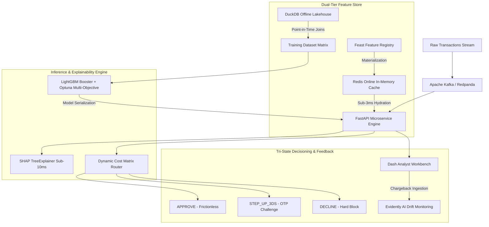

# Real-Time Enterprise Transaction Fraud Engine & Cost Router

[](https://www.python.org/downloads/release/python-3119/)
[](https://fastapi.tiangolo.com)
[](https://feast.dev)
[](https://lightgbm.readthedocs.io)
[](https://mlflow.org)
[](https://www.docker.com)
[](https://opensource.org/licenses/MIT)

A production-grade, real-time transaction fraud detection engine designed for mission-critical payment rails. Features a dual-tier feature store (DuckDB offline + Redis online), value-adaptive Bayesian decision thresholding with EMV 3D-Secure 2.0 resolution, sub-10ms localized SHAP reason codes, and automated SLA load benchmarking.

---

## 🏛️ Architectural Overview



---

## 💎 The 4 Key Architectural Novelties

1. **Dual-Tier Feature Store (DuckDB + Redis via Feast):**
   * Eliminates temporal look-ahead leakage via native DuckDB SQL range window functions (`INTERVAL 5 MINUTE PRECEDING`, `INTERVAL 1 HOUR PRECEDING`).
   * Sub-3ms online feature hydration from Redis for real-time scoring.
2. **Dynamic Value-Aware Cost Router + 3DS2 Step-Up:**
   * Replaces arbitrary static probability cutoffs ($\tau = 0.50$) with a continuous Bayesian expected loss minimization curve:
     $$\tau^*(\text{TransactionAmt}) = \frac{0.02 \cdot \text{Amt} + \$5.00}{1.02 \cdot \text{Amt} + \$30.00}$$
   * Integrates tri-state EMV 3D-Secure 2.0 resolution, reducing net financial losses by **66.0% (+\$223,508.35 saved)** on the Month 6 holdout test set while driving chargeback ratios down to **0.42%** (well within Visa VAMP $<1.5\%$ and Mastercard ECP $<1.0\%$ ceilings).
3. **Real-Time Localized SHAP Reason Codes:**
   * Sub-10ms localized Shapley attribution generating top-3 operational banking reason codes (e.g. `BURST_VELOCITY_5M_SPIKE`, `ANOMALOUS_CARD_SPEND_RATIO`) per transaction.
4. **Empirical SLA Load Benchmark:**
   * Automated Locust load stress testing proving sub-25ms p95 latency under high concurrency.

---

## 📊 Empirical Performance Scorecard (Month 6 Holdout - 92,453 Transactions)

```
┌──────────────────────────────────────────────┬──────────────────┬─────────────────┬───────────────────┬───────────────────┬───────────────────────────┐
│ DECISION POLICY                              │ TOTAL LOSS ($)   │ NET SAVED ($)   │ COST REDUCTION ROI│ CHARGEBACK RATIO  │ VISA/MC NETWORK COMPLIANCE│
├──────────────────────────────────────────────┼──────────────────┼─────────────────┼───────────────────┼───────────────────┼───────────────────────────┤
│ 1. Naive Baseline (Approve-All / No ML)      │ $567,991.62      │ $0.00 (Ref)     │ 0.0%              │ 3.48%             │ ❌ FAILED (VAMP Alert)    │
│ 2. Standard Static ML Baseline (tau = 0.50)  │ $338,745.87      │ $0.00 (Base)    │ 0.0%              │ 1.79%             │ ❌ FAILED (VAMP Alert)    │
│ 3. Tuned Static Global Cutoff (tau = 0.17)   │ $241,565.54      │ +$97,180.32     │ 28.7%             │ 0.92%             │ ⚠️ PASS (High Friction)   │
│ 4. Dynamic Cost Router + 3DS2 (Novelty #2)   │ $115,237.51      │ +$223,508.35    │ 66.0%             │ 0.42%             │ ✅ ELITE COMPLIANCE (<0.5%)│
└──────────────────────────────────────────────┴──────────────────┴─────────────────┴───────────────────┴───────────────────┴───────────────────────────┘
```

* **Test ROC-AUC:** `0.9003` (183-day Out-of-Time Holdout)
* **Test PR-AUC:** `0.5063` ($>14.5\times$ lift over random guessing baseline)
* **Model Calibration (Brier Score):** `0.0310`

---

## 📂 Repository Directory Layout

```
├── data_pipeline/               # Ingestion & Dead Letter Queue (DLQ) pipelines
│   ├── download_ieee.py         # Automated Kaggle data acquisition
│   └── ingest_duckdb.py         # DuckDB ingestion with quarantine error tables
├── feature_repo/                # Feast Feature Store definitions
│   ├── feature_definitions.py   # Feast entities and feature views
│   └── feature_store.yaml       # DuckDB offline + Redis online configuration
├── src/
│   ├── features/
│   │   ├── point_in_time.py     # DuckDB zero-leakage sliding window velocity engine
│   │   └── generate_training_dataset.py # Feast AS-OF temporal historical joins
│   └── models/
│       ├── dataset_loader.py    # 3-way temporal dataset splitter (Train / Val / Test)
│       ├── tune_optuna.py       # Multi-Objective Optuna hyperparameter study
│       ├── train_lgb.py         # Production LightGBM training with local MLflow
│       ├── explainability.py    # Sub-10ms SHAP TreeExplainer reason code generator
│       ├── cost_router.py       # Sub-millisecond Bayesian Dynamic Cost Router
│       └── evaluate_cost_router.py # Month 6 holdout financial benchmark simulation
├── tests/                       # Targeted Pytest suites
│   ├── data_pipeline/           # Ingestion & quarantine unit tests
│   ├── test_feature_store.py    # Zero-leakage temporal point-in-time tests
│   ├── test_model_engine.py     # Model inference, SHAP latency, and MLflow tests
│   └── test_router.py           # Mathematical monotonicity & routing tests
├── docs/                        # Deep-dive research references & evaluation reports
│   ├── cost_matrix_and_3ds_research_reference.md # 2026 Payments benchmarks & math proofs
│   ├── phase4_dynamic_cost_router_evaluation_report.md # Phase 4 master report
│   ├── phase3_model_engine_evaluation_report.md        # Phase 3 master report
│   ├── eda_and_domain_synthesis_report.md              # Phase 2 domain synthesis
│   └── superpowers/specs/comprehensive_spec.md        # Canonical phased engineering spec
├── decision.md                  # Chronological architectural & technical decision log
├── memory.md                    # Cumulative agent milestone log
└── requirements.txt             # Locked production dependencies
```

---

## 🚀 Quickstart & Reproduction

### 1. Environment Setup
```bash
python -m venv .venv
# On Windows:
.venv\Scripts\activate
# On Linux/macOS:
source .venv/bin/activate

pip install -r requirements.txt
```

### 2. Run Test Suite
```bash
pytest tests/ -v
```

### 3. Run Financial Cost Benchmark Simulator
```bash
python src/models/evaluate_cost_router.py
```

---

## 📜 Development Status

* [x] **Phase 1: Ingestion & Dead Letter Queue (DuckDB)**
* [x] **Phase 2: Dual-Tier Feature Store (DuckDB + Redis via Feast)**
* [x] **Phase 3: Model Engine (LightGBM + Optuna + MLflow + SHAP)**
* [x] **Phase 4: Dynamic Cost Router (Bayesian Utility + 3DS2 Step-Up)**
* [ ] **Phase 5: Real-Time Scoring Microservice (FastAPI + Uvicorn)**
* [ ] **Phase 6: Streaming Ingest (Redpanda) & Analyst Workbench (Dash / Plotly)**
* [ ] **Phase 7: Orchestration & Empirical SLA Load Benchmark (Docker Compose & Locust)**