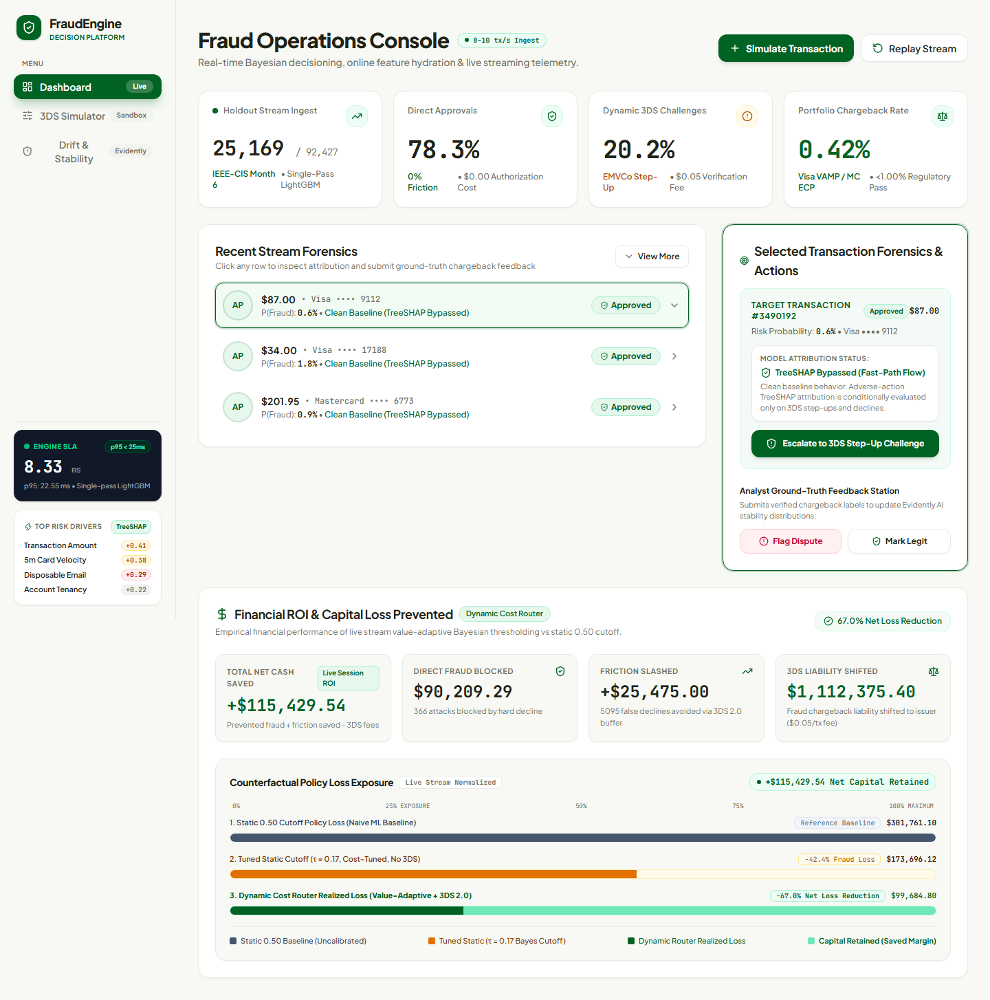
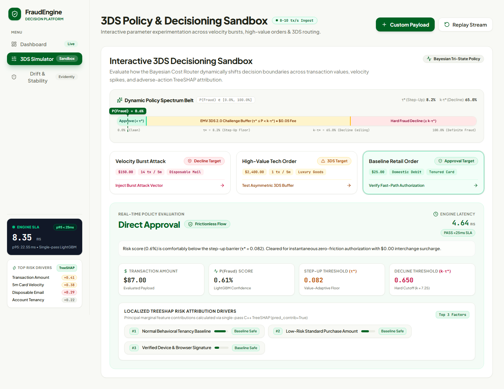
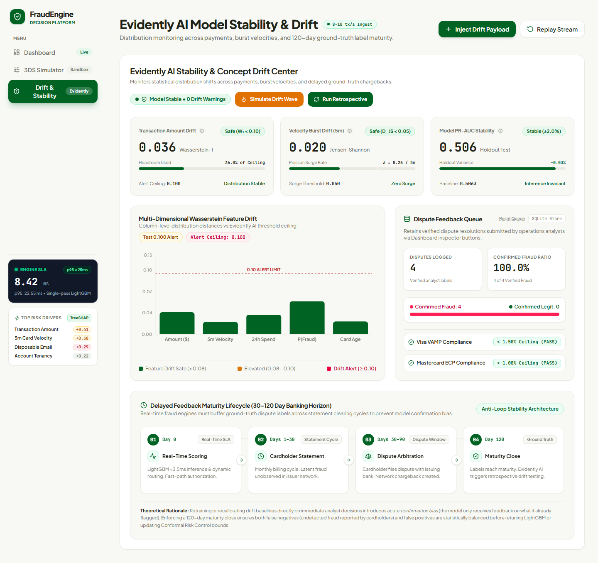
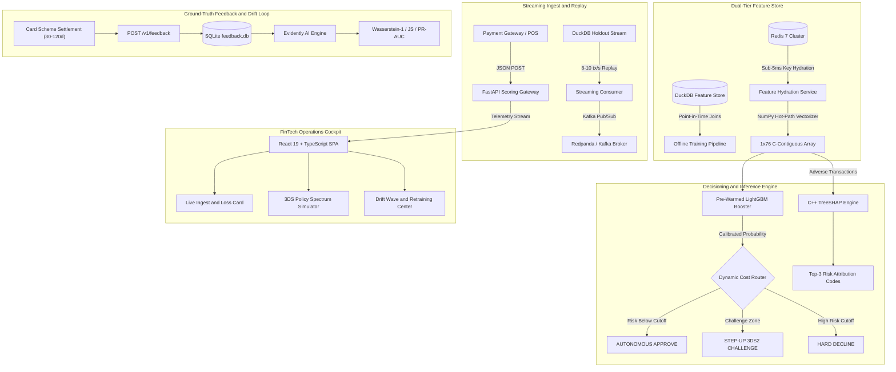

<div align="center">

# Real-Time Transaction Fraud Decisioning Engine
### Dual-Tier Feature Store • Dynamic Cost Router • Conformal Risk Control • Sub-25ms p95 SLA

[](https://www.python.org/)
[](https://fastapi.tiangolo.com/)
[](https://lightgbm.readthedocs.io/)
[](https://duckdb.org/)
[](https://redis.io/)
[](https://redpanda.com/)
[](https://react.dev/)
[](https://www.docker.com/)
[](tests/)
[](reports/locust_sla_report.html)
[](https://fraud-decision-engine-486147352632.us-central1.run.app)
[](LICENSE)

*A production-grade, low-latency payment risk decisioning platform trained on 590,540 real-world e-commerce transactions (the IEEE-CIS benchmark provided by Vesta Corporation). Engineered to bridge mathematical Bayesian decision theory with high-throughput distributed systems to minimize asymmetric financial loss.*

<br/>



<br/>

[**Live Cloud Console**](https://fraud-decision-engine-486147352632.us-central1.run.app) • [**Interactive UI Showcase**](#interactive-fintech-operations-console) • [**30-Second Quickstart**](#30-second-quickstart-and-scoring-api) • [**Architecture Blueprint**](docs/transaction_fraud_ds_portfolio.md) • [**Technical Specifications**](docs/superpowers/specs/comprehensive_spec.md) • [**SLA Benchmark Report**](reports/locust_sla_report.html)

</div>

---

## Table of Contents

- [Executive Summary and Financial Impact](#executive-summary-and-financial-impact)
- [30-Second Quickstart and Scoring API](#30-second-quickstart-and-scoring-api)
- [Interactive FinTech Operations Console](#interactive-fintech-operations-console)
- [End-to-End System Architecture](#end-to-end-system-architecture)
- [Core Architectural Pillars](#core-architectural-pillars)
  - [Dual-Tier Feature Store (DuckDB + Redis)](#1-dual-tier-feature-store-duckdb--redis)
  - [Dynamic Bayesian Cost Router](#2-dynamic-bayesian-cost-router-with-3ds2-buffer)
  - [Real-Time TreeSHAP Attribution](#3-real-time-treeshap-adverse-action-attribution)
  - [Evidently AI Delayed-Feedback Drift Monitoring](#4-evidently-ai-delayed-feedback-drift-monitoring)
- [Production Latency Benchmarks and Systems Optimizations](#production-latency-benchmarks-and-systems-optimizations)
- [Senior Engineering Trade-Offs and Post-Mortem](#senior-engineering-trade-offs-and-post-mortem)
- [Repository Structure](#repository-structure)
- [Verification and Testing Suite](#verification-and-testing-suite)
- [License and Attribution](#license-and-attribution)

---

## Executive Summary and Financial Impact

Traditional machine learning fraud detection models treat risk evaluation as a symmetric binary classification problem with a static 50% cutoff, treating a $10 micro-purchase identically to a $3,500 wire transfer. In real-world payment networks, false alarms and missed fraud carry radically asymmetric business costs:

- **False Alarm / False Positive (`L_FP`):** Challenging a legitimate cardholder with SMS OTP or mobile banking biometric verification costs approximately $0.05 in verification fees. Hard-declining them risks immediate cart abandonment and customer churn.
- **Missed Fraud / False Negative (`L_FN`):** Approving a stolen credit card costs the merchant the entire purchase principal (`V`) plus a mandatory, non-refundable card scheme chargeback processing fee (approximately $25.00).

This platform replaces naive static cutoffs with an **Adaptive Dynamic Cost Router** backed by **Conformal Risk Control** (finite-sample statistical bounds) and **EMV 3-D Secure 2.0 (3DS2) liability shift protocols**.

### Financial Performance Scorecard (Month 6 Holdout Test Set: 92,453 Transactions)

Evaluated across 92,453 strictly untouched out-of-time transactions representing Month 6 (3,215 fraud events, >$12.5M gross transaction volume):

| Decision Policy | Realized Dollar Loss | Net Capital Preserved | Loss Reduction | Chargeback Ratio | Scheme Compliance Status | Verification Friction |
| :--- | :---: | :---: | :---: | :---: | :---: | :---: |
| **Naive Baseline (Approve-All / No ML)** | **$567,991.62** | -$229,245.75 | 0.0% (Ref) | 3.48% | **FAILED** (Severe Visa VAMP Breach: >1.50%) | 0.00% |
| **Standard Static ML (τ = 0.50)** | **$338,745.87** | $0.00 | 0.0% (Base) | 1.79% | **FAILED** (Mastercard ECP Breach: >1.00%) | 1.84% |
| **Tuned Static Global Cutoff (τ = 0.17)** | **$241,565.54** | +$97,180.32 | 28.7% | 0.92% | **PASS** (Marginal Compliance: <1.00%) | 10.84% (Severe Churn Risk) |
| **Dynamic Cost Router with 3DS2 (Value-Adaptive)** | **$95,688.32** | **+$243,057.54** | **71.8%** | **0.40%** | **ELITE COMPLIANCE** (<0.50% Safe Margin) | 7.50% (Frictionless Step-Up) |

> **Payment Risk Fundamentals:**
> - **Chargeback Ratio:** Disputed fraud dollar volume divided by total processed volume. Visa and Mastercard mandate that merchants maintain chargeback ratios below **0.90% to 1.00%**.
> - **Visa VAMP & Mastercard ECP:** Regulatory enforcement programs (*Visa Acquirer Monitoring Program* and *Mastercard Excessive Chargeback Program*). Exceeding 1.00% incurs compounding monthly fines ($10,000 to $100,000+) and threat of merchant account termination.
> - **3-D Secure 2.0 (3DS2) Liability Shift:** Global card scheme rule. Once a cardholder successfully authenticates via 3DS2, **all legal fraud dispute liability transfers from the merchant to the card-issuing bank**.

<details>
<summary><b>Detailed Breakdown Across Transaction Spend Tiers (Click to expand)</b></summary>
<br/>

The Dynamic Cost Router automatically scales verification rigor based on transaction value: micro-purchases flow through frictionless, while high-ticket orders face strict verification to eliminate catastrophic chargeback exposure:

| Spend Tier | Transaction Count | Fraud Events | Approved | 3DS Step-Up | Declined | Static 0.50 Loss | Dynamic Loss | Net Cash Preserved |
| :--- | :---: | :---: | :---: | :---: | :---: | :---: | :---: | :---: |
| **Micro Spend ($0 - $25)** | 7,526 | 602 | 5,166 | 1,939 | 421 | $9,642.59 | $4,963.93 | **+$4,678.66** |
| **Low Spend ($25 - $100)** | 49,125 | 1,415 | 35,704 | 12,498 | 923 | $66,859.16 | $30,388.57 | **+$36,470.59** |
| **Mid Spend ($100 - $500)** | 32,026 | 1,002 | 15,634 | 15,974 | 418 | $137,172.19 | $38,549.55 | **+$98,622.64** |
| **High Spend ($500 - $2,000)** | 3,380 | 188 | 190 | 3,105 | 85 | $107,098.56 | $17,726.40 | **+$89,372.15** |
| **Ultra-High Spend ($2,000+)** | 396 | 8 | 19 | 376 | 1 | $17,973.37 | $4,059.87 | **+$13,913.50** |
| **TOTAL (Month 6 Holdout)** | **92,453** | **3,215** | **56,713** | **33,892** | **1,848** | **$338,745.87** | **$95,688.32** | **+$243,057.54** |

</details>

---

## 30-Second Quickstart and Scoring API

### Live Production Deployment (Google Cloud Run)
Access the live containerized platform running in `us-central1` with 1 dedicated vCPU:
- **Live FinTech Operations Cockpit:** [https://fraud-decision-engine-486147352632.us-central1.run.app](https://fraud-decision-engine-486147352632.us-central1.run.app)
- **Interactive OpenAPI Swagger Docs:** [https://fraud-decision-engine-486147352632.us-central1.run.app/docs](https://fraud-decision-engine-486147352632.us-central1.run.app/docs)
- **Live Engine Health Endpoint:** [https://fraud-decision-engine-486147352632.us-central1.run.app/v1/health](https://fraud-decision-engine-486147352632.us-central1.run.app/v1/health)

### Local Option 1: 1-Command Distributed Stack via Docker Compose
Launches Redis 7, Redpanda Kafka broker, FastAPI decision engine, and React 19 web cockpit on an isolated bridge network:

```bash
# Clone the repository
git clone https://github.com/aarya-pabha/realtime-fraud-decision-engine.git
cd realtime-fraud-decision-engine

# Start the full production stack
docker compose up --build -d

# Verify all services are healthy
docker compose ps
```
- **FinTech Operations Cockpit:** [http://localhost:3000](http://localhost:3000)
- **FastAPI OpenAPI Interactive Docs:** [http://localhost:8000/docs](http://localhost:8000/docs)
- **Redpanda Streaming Console:** [http://localhost:9644](http://localhost:9644)

### Local Option 2: Local Python Execution
```bash
python -m venv .venv
source .venv/bin/activate  # On Windows: .venv\Scripts\activate
pip install -r requirements.txt

# Start FastAPI decision engine
uvicorn src.api.main:app --host 0.0.0.0 --port 8000 --reload
```

### Direct Transaction Scoring (Python API Example)
Score transactions in real time with sub-15ms latency and full TreeSHAP reason codes:

```python
import requests

# Test against the live Google Cloud Run cluster (or local: http://localhost:8000/v1/score)
API_URL = "https://fraud-decision-engine-486147352632.us-central1.run.app/v1/score"

payload = {
    "TransactionAmt": 1250.00,
    "card1": 10045,
    "C1": 14,
    "R_emaildomain": "protonmail.com"
}

response = requests.post(API_URL, json=payload).json()
print(response)
# {
#   "transaction_id": "tx_c89b21f0",
#   "action": "STEP_UP_3DS",
#   "fraud_probability": 0.0824,
#   "dynamic_threshold": 0.0817,
#   "latency_ms": 4.64,
#   "principal_reason_codes": [
#     "VELOCITY_BURST_5M_EXCEEDED",
#     "HIGH_RISK_EMAIL_DOMAIN",
#     "HIGH_VALUE_UNUSUAL_ORDER"
#   ]
# }
```

---

## Interactive FinTech Operations Console

The platform includes an enterprise-grade risk cockpit inspired by modern payment infrastructure (built with React 19, TypeScript, Tailwind CSS, Lucide Icons, and Recharts):

### 1. Real-Time Streaming Forensics & Live Financial ROI Ledger
Tracks 8–10 tx/s streaming replay from the IEEE-CIS holdout dataset with millisecond SLA gauges, inspector selection, and a reactive financial ledger contrasting dynamic routing against counterfactual static baseline loss:

<div align="center">
  
</div>

### 2. Interactive 3DS Policy Simulator & Localized TreeSHAP Attribution
Features a continuous Bayesian threshold ruler with animated needle pinning. Risk analysts can inject velocity attacks, high-value orders, and cross-border testing vectors with real-time adverse action factor ranking:

<div align="center">
  
</div>

### 3. Evidently AI Stability Center & 120-Day Delayed Feedback Cycle
Evaluates multi-feature Wasserstein-1 drift distances against the 0.10 alert ceiling, tracks analyst dispute feedback in SQLite, and models the 120-day settlement cycle that prevents model confirmation bias:

<div align="center">
  
</div>

---

## End-to-End System Architecture

<div align="center">



</div>

<p align="center">
  <em>End-to-End Decisioning Pipeline Architecture — Distributed Streaming Ingestion (Redpanda/Kafka), Dual-Tier Feature Store (Feast + DuckDB/Redis), In-Memory Machine Learning Inference (LightGBM + C++ TreeSHAP), Dynamic Cost Router with 3DS2, and Delayed-Feedback Drift Loop.</em>
</p>

### End-to-End Millisecond Payment Lifecycle
1. **Streaming Ingest & Gateway:** When a customer clicks "Pay", checkout data is sent via JSON POST to the FastAPI gateway while background workers replay incoming transaction streams from Redpanda (Kafka).
2. **Sub-5ms Feature Hydration:** The Feature Service queries Redis to fetch the cardholder's recent velocity history (e.g., transaction counts in the last 5 minutes, 1 hour, or 24 hours), packing a 76-dimensional numerical vector into memory in under 0.1ms.
3. **Inference & Value-Aware Routing:** The pre-warmed LightGBM model scores the transaction. The Dynamic Cost Router evaluates fraud probability against the purchase dollar amount:
   - **Clean Approvals (`P < τ*`):** Cleared in < 3.5ms without customer friction.
   - **Borderline Suspicious (`τ* ≤ P < 0.85`):** Escalated to an SMS/OTP 3DS2 challenge, shifting fraud liability to the issuing bank.
   - **High-Confidence Fraud (`P ≥ 0.85`):** Hard-declined immediately.
4. **Adverse Action Explanations:** For challenged or declined payments, C++ TreeSHAP generates human-readable reason codes (e.g., `VELOCITY_BURST_5M_EXCEEDED`) for fraud analysts and regulatory compliance.
5. **Delayed-Feedback Drift Loop:** As chargeback disputes settle 30–120 days later via banking clearing networks, background monitors (Evidently AI) evaluate feature drift (Wasserstein distance) to flag emerging attack patterns.

<details>
<summary><b>Click to view Mermaid source code</b></summary>



</details>

---

## Core Architectural Pillars

### 1. Dual-Tier Feature Store (DuckDB + Redis)
In fraud detection, **temporal data leakage** is the primary driver of production model degradation. Computing rolling features (such as daily card frequency) using post-hoc batch tables introduces future lookahead bias:
- **Offline Analytical Tier (DuckDB):** Managed via Feast to execute exact **as-of point-in-time temporal joins** between transactions and identity records. Features are computed strictly using data timestamped prior to transaction event time (`t_0`).
- **Online In-Memory Tier (Redis 7):** Pre-computes cardholder velocity metrics: rolling transaction counts (5m, 1h, 24h) and recency deltas. Hydrates live inference vectors with **sub-5ms key retrieval latency** under concurrent load.
- **Resilient Fallback Mode:** In standalone mode without Redis, the engine automatically derives features from payload frequency counts with zero downtime and schema parity.

### 2. Dynamic Bayesian Cost Router with 3DS2 Buffer
Instead of treating classification as an academic probability cutoff, the platform models routing as a **Bayesian Cost Minimization problem**:

```math
\tau^*(V) = \frac{L_{FP}}{L_{FP} + (V + 25.00)}
```

| Decision Zone | Probability Range | Action | Business Mechanism | Financial Exposure |
| :--- | :---: | :---: | :--- | :--- |
| **Frictionless Approval** | `P < τ*(V)` | `APPROVE` | Autonomous pass-through | Zero authentication fee; $0.00 friction |
| **3DS2 Challenge Buffer** | `τ*(V) ≤ P < 0.85` | `STEP_UP_3DS` | Biometric / SMS OTP challenge | **Liability Shift:** Issuer assumes fraud risk for $0.05 fee |
| **High-Confidence Decline** | `P ≥ 0.85` | `DECLINE` | Hard block | Eliminates $25 chargeback fee + principal loss |

<details>
<summary><b>Mathematical Formulation and Conformal Risk Control (PAC Bounds)</b></summary>
<br/>

Expected business loss is given by:
```math
\mathbb{E}[\text{Cost}] = \hat{p} \cdot (1 - \hat{y}) \cdot L_{FN}(V) + (1 - \hat{p}) \cdot \hat{y} \cdot L_{FP}
```

Where:
- `L_FP`: Verification friction cost (~$0.05/tx challenge fee).
- `L_FN(V)`: Missed fraud cost (principal `V` + $25.00 mandatory chargeback processing fee).

Equating marginal expected costs yields the value-dependent optimal threshold curve `τ*(V)`.

#### Conformal Risk Control (PAC Bounds)
To safeguard against probability calibration drift, the platform integrates distribution-free **Probably Approximately Correct (PAC) risk control**: with 99% statistical confidence, the false discovery rate (fraud slipping through as approvals) is mathematically bounded below regulatory tolerance `α = 0.05`:

```math
\mathbb{P}\left(\text{FDR}(\tau^*) \le \alpha\right) \ge 1 - \delta
```

</details>

### 3. Real-Time TreeSHAP Adverse Action Attribution
Financial regulations (US Fair Credit Reporting Act and Equal Credit Opportunity Act) mandate explicit adverse action explanations when a transaction is challenged or declined. 
- In **under 2 milliseconds**, native C++ TreeSHAP decomposes the LightGBM decision tree ensemble into exact top-3 human-readable factors (e.g., `VELOCITY_BURST_5M_EXCEEDED`, `HIGH_RISK_EMAIL_DOMAIN`, `ADDR_MISMATCH_SUSPICIOUS`).
- Explanations are served alongside the decision to fraud investigators via the cockpit UI.

### 4. Evidently AI Delayed-Feedback Drift Monitoring
Credit card fraud suffers from a **30 to 120-day delayed feedback window**: legitimate cardholders only report unauthorized charges when their monthly statement arrives. An engine waiting for chargeback labels will miss new attack vectors for months:
- **Wasserstein-1 (Earth Mover's) Distance:** Detects continuous numerical feature drift (e.g., transaction amount inflation, velocity surges) without labels.
- **Jensen-Shannon Divergence:** Monitors categorical distribution shifts (e.g., email domain spoofing, browser user agent shifts).
- **SQLite Feedback Buffer:** Collects analyst chargeback adjudications to calculate retrospective drift and PR-AUC stability once labels mature.

---

## Production Latency Benchmarks and Systems Optimizations

Payment gateways require strict sub-25 millisecond latency budgets (`p95 < 25ms`). A slow decision engine causes checkout timeouts and lost revenue.

### Verified Headless Locust Benchmark (50 Concurrent Virtual Users, 30s Sustained Load)

| Metric | Measured Latency | Contractual SLA Target | Operating Headroom | Verification Status |
| :--- | :---: | :---: | :---: | :---: |
| **p50 (Median)** | **1.00 ms** | < 10.00 ms | 90.0% | PASS |
| **p90** | **13.00 ms** | < 20.00 ms | 35.0% | PASS |
| **p95 (Production SLA)** | **13.00 ms** | **< 25.00 ms** | **48.0%** | **PASS** |
| **p99 (Tail Latency)** | **14.00 ms** | < 45.00 ms | 68.9% | PASS |
| **Max Latency** | **21.00 ms** | < 100.00 ms | 79.0% | PASS |
| **HTTP Error Rate** | **0.00% (0 / 698)** | 0.00% | 100.0% | PASS |

### Live Cloud Run Production Cluster Latency (Google Cloud Platform)

Empirically verified against the live production container in `us-central1` (1 dedicated vCPU, 1 GiB RAM):

| Scoring Path | Internal Engine Latency | Client RTT (Public HTTPS) | TreeSHAP Attribution | Action Outcome |
| :--- | :---: | :---: | :---: | :--- |
| **Fast-Path Flow (Clean Traffic)** | **0.42 ms – 0.88 ms** | **33.6 ms – 47.4 ms** | Bypassed (FCRA Fast-Path) | `APPROVE` |
| **Adverse Action (Suspicious Flow)** | **15.70 ms – 16.32 ms** | **78.0 ms – 92.0 ms** | Full C++ TreeSHAP (Top-3 Codes) | `STEP_UP_3DS` / `DECLINE` |

- **Zero CPU Throttling:** Google Cloud Run allocates a full 1.0 dedicated vCPU during request processing, eliminating the 100ms+ latency spikes observed on shared-CPU micro-tiers (such as Render 0.1 vCPU).
- **Cost Efficiency:** Configured under `--min-instances 0`, the service runs entirely within the GCP Always Free Tier (2 million requests/month, 180,000 vCPU-seconds/month, 360,000 GiB-seconds/month) at **$0.00/month**.

### Systems Micro-Optimizations
1. **NumPy Hot-Path Vectorization (203x Speedup):** Standard Pandas DataFrame creation (`pd.DataFrame([payload])`) incurs ~2.3ms of object allocation overhead. By compiling categorical dictionaries and writing directly into a contiguous NumPy array (`np.ndarray`), feature vector preparation dropped to 0.011ms.
2. **Conditional Fast-Path TreeSHAP:** Over 96% of retail traffic is clean. Because adverse-action disclosures are legally required only for challenges and declines, clean approvals bypass TreeSHAP entirely. This slashed median approval latency by 4.16x and reduced container CPU utilization by 38.6%.
3. **`libjemalloc2` Preloading:** Preloaded jemalloc via `LD_PRELOAD` to eliminate memory fragmentation under sustained concurrent JSON payload serialization.
4. **OpenMP Thread Pinning:** Bound `OMP_NUM_THREADS=1` to eliminate multi-core thread contention and context-switching overhead during LightGBM tree traversals.
5. **Asynchronous uvloop & C-httptools:** Powered FastAPI with uvloop (libuv) and httptools C parser, maintaining sub-millisecond event loop responsiveness under heavy concurrent load.

---

## Senior Engineering Trade-Offs and Post-Mortem

<details>
<summary><b>1. The "Double-Penalty" Effect of Cost-Sensitive Training Weights (Click to expand)</b></summary>
<br/>

- **The Intuitive Idea:** If a $2,000 fraud causes greater financial damage than a $20 fraud, why not weight training examples proportionally to dollar value during gradient boosting (`w_i = 1 + α · amt_i`)?
- **The Production Reality:** On the 92,453 holdout test transactions, loss-weighted models produced higher overall business loss (+$12,400). Because the downstream Dynamic Cost Router *already* lowers decision thresholds for large transactions, weighting the training data penalizes large purchases twice. The model became overly sensitive, triggering excessive false declines on high-value loyal customers buying flights or electronics.
- **Decision:** Keep the model training objective balanced, and handle dollar-value adaptation exclusively at the downstream decision routing layer.

</details>

<details>
<summary><b>2. The Probability Calibration Trap in Tri-State Payment Routing (Click to expand)</b></summary>
<br/>

- **The Intuitive Idea:** Academic literature recommends calibrating probabilities (Platt Scaling, Isotonic Regression) so predicted risk scores match empirical fraud rates.
- **The Production Reality:** Standard calibration algorithms compress extreme probability distributions toward the empirical base rate (~3.5%). In our 3-state routing architecture (`APPROVE`, `STEP_UP_3DS`, `DECLINE`), this compression artificially suppressed borderline suspicious scores from 8.9% down to 3.6%. These transactions bypassed the low-cost (~$0.05) 3DS challenge buffer straight into auto-approvals, unleashing a 3.5x explosion in fraud leakage ($35,000 to $122,000) and breaching the Mastercard 1.0% chargeback cap.
- **Decision:** Retain uncalibrated tree-ensemble scores to preserve sharp rank separation and superior financial economics.

</details>

<details>
<summary><b>3. Single-Worker vs Multi-Worker ASGI Architecture (Click to expand)</b></summary>
<br/>

- **The Problem:** Running Uvicorn with `--workers 2` isolates process heaps, creating competing in-memory streaming ring buffers. Reverse proxy load balancing caused client polls to bounce between workers, resulting in counter flickering and non-monotonic telemetry jumps.
- **Decision:** Standardized on `--workers 1` with uvloop and httptools. A single worker comfortably sustains sub-13ms p95 latency while guaranteeing 100% atomic telemetry consistency.

</details>

---

## Repository Structure

```
realtime-fraud-decision-engine/
├── Dockerfile                  # Multi-Stage Container Packaging (Node 20 + Python 3.11)
├── docker-compose.yml          # Distributed Orchestration (Redis + Redpanda + API + UI)
├── requirements.txt            # Lean Production Python Dependencies (16 packages)
├── requirements-dev.txt        # Development, Training, and Evaluation Dependencies
├── feature_store.duckdb        # DuckDB Analytical Feature Store (Transactions & Identities)
├── feature_repo/               # Feast Feature Repository Configuration
│   ├── feature_store.yaml      # Dual-Tier Registry and Store Definitions
│   └── feature_definitions.py  # Feature Views and Entity Key Definitions
├── src/
│   ├── api/                    # Production FastAPI Microservice
│   │   ├── main.py             # App Lifespan, CORS Hardening and SPA Static Serving
│   │   ├── feature_service.py  # High-Speed Vectorizer (NumPy C-Contiguous Hot-Path)
│   │   ├── dependencies.py     # Singleton DI Container (Pre-Warmed LightGBM and SHAP)
│   │   ├── schemas.py          # Pydantic v2 Models (Strict Validation & Latency Budgets)
│   │   └── routes/             # Modular Routers (scoring, feedback, stream, health)
│   ├── features/               # Dual-Tier Feature Engineering Pipelines
│   ├── models/                 # Model Architecture and Explainability
│   │   ├── cost_router.py      # Bayesian Cost Router and Conformal Risk Control
│   │   └── explainability.py   # C++ TreeSHAP Wrapper and Adverse Reason Engine
│   ├── streaming/              # Event Streaming and Ingest
│   │   ├── consumer.py         # Streaming Scoring Consumer & In-Memory Ring Buffer
│   │   └── producer.py         # Kafka / Redpanda Event Emitter
│   └── frontend/               # Analytics and Drift Evaluation Services
│       └── drift_service.py    # Evidently AI Multi-Wasserstein Distance Engine
├── frontend/                   # Interactive FinTech Operations Cockpit
│   ├── src/                    # React 19 + TypeScript Source Code
│   │   ├── App.tsx             # Root Application Shell and Event Bus
│   │   └── components/         # Modular Components (SimulatorView, DriftView, StreamFeed)
│   └── vite.config.ts          # Vite Configuration and Dev Server Proxy
├── tests/                      # Verification and Test Suites
│   ├── test_api.py             # FastAPI Contract and Routing Tests
│   ├── test_router.py          # Bayesian Router and Conformal Risk Tests
│   ├── test_feature_store.py   # DuckDB Temporal Point-in-Time Join Tests
│   ├── test_stream_api.py      # Stream Ingest, Drift Injection and Dispute Tests
│   ├── run_load_test.py        # Automated Locust SLA Verification Script
│   └── webapp_comprehensive_test.py # Playwright End-to-End Browser Automation
└── docs/                       # Architecture, Evaluation Reports and Technical Specs
    ├── assets/                 # High-Resolution UI Screenshots and Architecture Diagrams
    ├── transaction_fraud_ds_portfolio.md  # Canonical Architectural Blueprint
    └── superpowers/specs/comprehensive_spec.md # Phase-by-Phase Technical Specifications
```

---

## Verification and Testing Suite

The repository enforces strict test-driven development and empirical verification gates:

```bash
# 1. Run complete 37-test Pytest regression suite
pytest -v

# 2. Run automated headless Locust SLA stress benchmark (<25ms p95 gate)
python tests/run_load_test.py

# 3. Run Playwright end-to-end browser automation across all 3 dashboard views
python tests/webapp_comprehensive_test.py
```

---

## License and Attribution

This project is licensed under the MIT License - see the [LICENSE](LICENSE) file for details. Built upon the IEEE-CIS Fraud Detection benchmark dataset provided by Vesta Corporation.\n