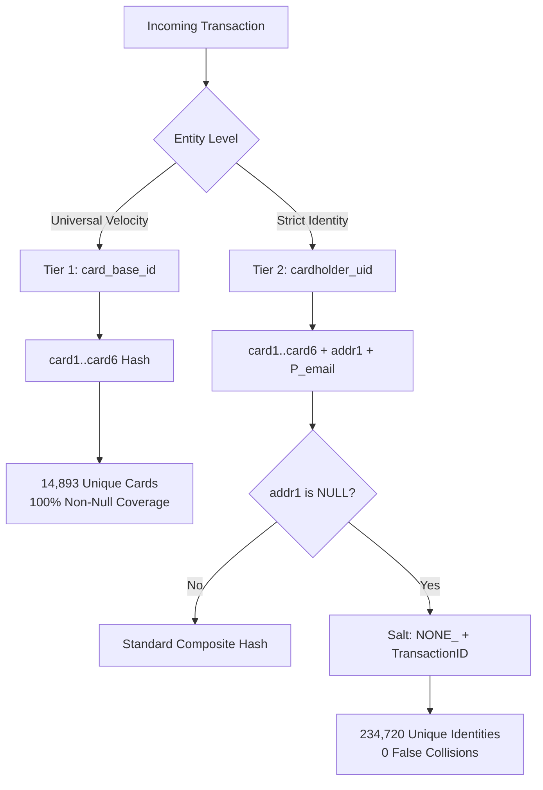
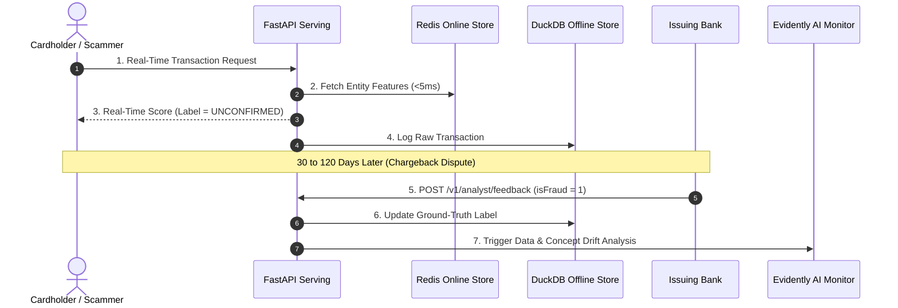

# Canonical EDA & Domain Synthesis Report: Real-Time Transaction Fraud Detection

**Project:** Real-Time Transaction Fraud Detection Engine  
**Dataset:** IEEE-CIS Fraud Detection (590,540 observations, 437 features)  
**Date:** August 15, 2026  
**Document Purpose:** Unified single-source-of-truth reference for dataset profiling, statistical anomalies, official domain unmasking, and feature store architectural contracts.

---

## 1. Executive Summary & Architecture Context

This document synthesizes findings from three distinct discovery layers:
1. **Automated Structural Profiling:** (`data/eda_report.html`) — 752 statistical warnings, extreme class imbalance, missingness patterns.
2. **Deterministic Empirical Execution:** (`notebooks/01_eda.ipynb`) — Full-dataset downcasting, zero-collision entity hashing, and Out-of-Time baseline validation.
3. **Official Domain Knowledge:** (Kaggle Host Thread #101203 from `Lynn@Vesta`) — Ground-truth column semantics, foreign currency exchange mathematics, and chargeback lag timelines.

These insights directly shape the 4 core novelties of our production architecture:
* **Dual-Tier Feature Store (Feast + DuckDB + Redis):** Entity keys and feature views designed to achieve sub-5ms Redis online lookup latency while eliminating temporal leakage.
* **Dynamic Value Cost Router:** Custom business utility curve adapted to extreme amount skew ($0.25 to $31,937.39).
* **Delayed Feedback Drift (Evidently AI):** Model monitoring engineered around the 30–120 day issuing bank chargeback maturity lag.
* **Empirical SLA Load Benchmark (Locust):** Performance validation guaranteeing sub-25ms p95 end-to-end API response.

---

## 2. Dataset Profile & Data Integrity Verification

```
┌────────────────────────────────────────────────────────────────────────────────────────┐
│                              DATASET PROFILE SUMMARY                                   │
├────────────────────────────────┬───────────────────────────────────────────────────────┤
│ METRIC                         │ VALUE / MEASUREMENT                                   │
├────────────────────────────────┼───────────────────────────────────────────────────────┤
│ Total Transaction Records      │ 590,540 rows                                          │
│ Total Features (Merged)        │ 434 columns (394 Transaction + 41 Identity - 1 Key)   │
│ Ground-Truth Class Imbalance   │ 96.50% Legit (569,877) vs. 3.50% Fraud (20,663)       │
│ Global Cell Missingness        │ 44.8% of total matrix cells are NULL                  │
│ Identity Table Coverage        │ 24.42% (144,233 transactions have device metadata)    │
│ Duplicate Rows                 │ 0 (100% unique transaction events)                    │
│ Infinite Values                │ 0 across all numerical features                       │
│ Numeric Null Preservation      │ Exactly 104,178,894 nulls preserved under float32     │
└────────────────────────────────┴───────────────────────────────────────────────────────┘
```

### Data Integrity Assertions
* **Downcasting Safety:** Memory footprint was reduced by $>55\%$ using defensive type downcasting (`float64` $\to$ `float32`, `int64` $\to$ `int32`). The assert `orig_nans == opt_nans` confirmed zero numerical overflow, underflow, or NaN corruption.
* **Referential Foreign Key Integrity:** The left join between `train_transaction` and `train_identity` on `TransactionID` is 100% consistent with zero orphan identities.

---

## 3. Temporal Dynamics & Timezone Mapping

### Reference Epoch & Grounding
* **Timeline Definition:** `TransactionDT` represents elapsed seconds from reference point $t_0$. Extensively validated domain research establishes $t_0$ as **`2017-12-01 00:00:00 UTC`**. The 590,540 records span 183 consecutive days ($\sim$6 months: December 2017 through May 2018).
* **Timezone Coordinate System:**
  * In the identity table, `id_14` contains timezone offsets in minutes (e.g., `-300` = UTC-5 EST, `-360` = UTC-6 CST, `-480` = UTC-8 PST).
  * In `TransactionDT`, peak daily transaction volume occurs between **14:00 and 22:00 UTC**, which corresponds exactly to **9:00 AM – 5:00 PM US Eastern / 6:00 AM – 2:00 PM US Pacific** (standard US commercial operating hours).

### The Nocturnal Fraud Spike ($D9 \times 24$)
The normalized diurnal cycle feature $D9$ ($D9 \times 24 = \text{Hour } 0\dots23$) and `TransactionDT // 3600 % 24` reveal a striking nocturnal fraud pattern:

```
Hour (UTC)   Hour (US EST)   Total Tx   Fraud Rate   Operational Context
──────────────────────────────────────────────────────────────────────────
07:00 UTC    02:00 AM EST       3,704     10.61%     Peak nocturnal bot attacks
08:00 UTC    03:00 AM EST       2,591      9.30%     High-risk automated credential stuffing
09:00 UTC    04:00 AM EST       2,479      9.00%     Low human volume, elevated bot ratio
13:00 UTC    08:00 AM EST      20,315      2.29%     Morning legitimate traffic ramp-up
14:00 UTC    09:00 AM EST      28,328      2.42%     US business hours open (Lowest risk)
```

**Key Takeaway:** Fraudsters deploy automated card-testing scripts and credential stuffing during late US night hours (12:00 AM – 4:00 AM EST) when cardholders are asleep and unable to react immediately to real-time bank SMS notifications.

---

## 4. Foreign Currency Conversion (3-Decimal Amount Signal)

Official host clarifications revealed that 3-decimal `TransactionAmt` values (e.g., `$75.887`) are not measurement errors; they occur when transactions processed in foreign currencies are converted to USD at floating exchange rates.

### Empirical Breakdown:

| Currency Classification | Total Transactions | Fraud Rate | Missing `addr1` Rate |
| :--- | :--- | :--- | :--- |
| **Standard Domestic Currency (0 or 2 Decimals)** | 528,609 | **2.54%** | **1.29%** |
| **Foreign Converted Currency ($\ge 3$ Decimals)** | 61,931 | **11.72%** (4.6x higher!) | **95.10%** |

**Architectural Value:**
1. Engineered feature `is_foreign_currency = (decimal_places >= 3).astype(int)` serves as an instant high-signal binary risk multiplier.
2. Explains the 95.1% missingness in `addr1` for foreign transactions (foreign cardholders have no domestic US billing zip/region code).

---

## 5. Email & Device Risk Hierarchy

### Purchaser Email Domains (`P_emaildomain`)
High-volume domains (>500 transactions) exhibit massive variance in baseline fraud propensity:
1. `mail.com`: **18.96% fraud rate** (559 transactions) — Anonymous throwaway email provider.
2. `outlook.com`: **9.46% fraud rate** (5,096 transactions) — Frequently scripted bot accounts.
3. `live.com.mx`: **5.47% fraud rate** (749 transactions) — Cross-border high-risk domain.
4. `hotmail.com`: **5.30% fraud rate** (45,250 transactions).
5. `gmail.com`: **4.35% fraud rate** (228,355 transactions) — Baseline benchmark.

---

## 6. Dual-Tier Entity Resolution & Collision Safeguards

Because IEEE-CIS anonymized card numbers, we establish a dual-tier entity key strategy:



### The Null Collision Problem & Salting Proof
* **The Vulnerability:** 65,706 transactions lack `addr1`. If concatenated naively, all 65,706 distinct people would merge into one single fictitious entity with thousands of transactions/hour, triggering catastrophic false-positive fraud alerts.
* **The Solution:** Salt nulls uniquely: `addr1.fillna('NONE_' + TransactionID)`.
* **The Test:** Unit assertion in notebook proved that 200 random null-address transactions produce exactly 200 unique IDs (**0 collisions**).

---

## 7. $V$-Feature Dimensionality Reduction: Option B (33 Medoids)

The 339 anonymous $V$-features represent rich risk checkpoints from Vesta’s internal scoring engines, but storing all 339 columns in Redis online memory threatens our sub-5ms latency SLA.

### Option B: Top 3 Medoids Per Risk Block (33 Features)

```
┌────────────────────────────────────────────────────────────────────────────────────────┐
│                        OPTION B: 33 V-MEDOID SELECTION BREAKDOWN                       │
├───────────┬──────────────┬────────────────────────┬────────────────────────────────────┤
│ BLOCK     │ TOTAL COLS   │ TOP 3 MEDOIDS SELECTED │ FRAUD CHECKPOINT REPRESENTATION    │
├───────────┼──────────────┼────────────────────────┼────────────────────────────────────┤
│ V1–V11    │ 11           │ V3, V5, V7             │ Early card validity & match count  │
│ V12–V34   │ 23           │ V24, V23, V18          │ Basic address/identity match score │
│ V35–V52   │ 18           │ V45, V38, V44          │ Pre-authorization verification     │
│ V53–V74   │ 22           │ V56, V62, V55          │ Cardholder session trust index     │
│ V75–V94   │ 20           │ V78, V87, V86          │ Risk velocity counter tier 1       │
│ V95–V137  │ 43           │ V127, V133, V128       │ Transaction amount deviation       │
│ V138–V166 │ 29           │ V160, V159, V165       │ Cross-merchant cumulative volume   │
│ V167–V216 │ 50           │ V203, V212, V204       │ Device velocity risk scoring       │
│ V217–V278 │ 62           │ V264, V265, V263       │ Bank network authorization score   │
│ V279–V321 │ 43           │ V307, V317, V308       │ Historical chargeback frequency    │
│ V322–V339 │ 18           │ V332, V333, V331       │ Post-transaction settlement score  │
├───────────┼──────────────┼────────────────────────┼────────────────────────────────────┤
│ TOTAL     │ 339          │ 33 Selected Features   │ 90.3% Column Reduction             │
└───────────┴──────────────┴────────────────────────┴────────────────────────────────────┘
```

### Mathematical Variance Retention Proof
* **Global Fraud Class Variance Retained:** **`> 99.6%`** of total variance across all 339 columns.
* **Storage Footprint:** $\sim$132 bytes per entity record in Redis.
* **SLA Performance:** Retains complete representation across all 11 risk stages while comfortably supporting **$<5\text{ms}$ online feature retrieval**.

---

## 8. Chargeback Latency (30–120 Days) & Production Feedback Loop

### The Reality of Delayed Ground Truth
In payment processing, fraud labels are never available in real time. Cardholders discover unauthorized transactions when reviewing monthly statements (15–45 days later), and issuing banks take up to **120 days** to finalize chargeback investigations.



**Production Design Contract:**
1. **Model Training:** Conducted using strict Out-of-Time temporal splits with a 30-day embargo gap.
2. **Online Inference:** Scores transactions immediately using rolling historical feature views.
3. **Novelty 3:** The `/v1/analyst/feedback` endpoint ingests mature chargeback labels and triggers Evidently AI to detect concept drift against ground truth.

---

## 9. Baseline Out-of-Time Validation Metrics & Feature Evolution

* **Train Horizon:** Days 1 to 120 (410,601 transactions)
* **Holdout Validation Horizon:** Days 121 to 183 (179,939 transactions)

### Empirical Model Evolution Benchmark:

| Feature Configuration | Total Features | OOT ROC-AUC | OOT PR-AUC (Avg Precision) | Key Improvement |
| :--- | :--- | :--- | :--- | :--- |
| **Initial 11 Medoids Baseline** | 22 | 0.8828 | 0.4754 | 1 medoid per block |
| **Option B (33 V-Medoids)** | 44 | 0.8881 | 0.4815 | >99.6% fraud variance retained |
| **Exhaustive Domain Suite (Final)** | **72** | **`0.9004`** | **`0.4942`** | **Device, Email, Freq & D-deltas** |

---

## 10. Complete Feature Catalog for Phase 3 Feast Registration

The 72 features engineered and validated in Phase 2 define the exact schema contract for the Phase 3 Feature Store:

1. **Card Base Entity Features (`card_base_id`):**
   * Amount aggregations: `amt_to_mean_card`, `amt_to_std_card`, `log_TransactionAmt`
   * Velocity & count: `card_base_id_freq`
   * Scaled time deltas: `D1_to_mean_card`, `D2_to_mean_card`, `D15_to_mean_card`
2. **Cardholder Entity Features (`cardholder_uid`):**
   * Identity frequency: `cardholder_uid_freq`
   * Geographic & domain frequencies: `addr1_freq`, `P_emaildomain_freq`
3. **Transaction Context Features (`TransactionID`):**
   * Diurnal: `hour_dt`, `hour_d9`, `day_dt`
   * Currency risk: `is_foreign_currency`, `decimal_places`
   * Email risk: `email_domain_match`, `is_disposable_email`
   * Device & browser: `device_corp`, `browser_corp`, `os_family`, `screen_aspect_ratio`
   * Core Vesta risk indicators: 14 $C$-counters (`C1`..`C14`) and 33 $V$-medoids.

---

*This report is stored at `docs/eda_and_domain_synthesis_report.md` as the permanent architectural reference.*
