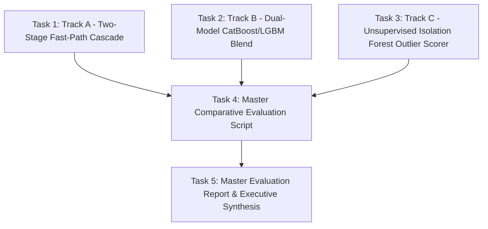

# Implementation Plan: Bonus Multi-Model & Cascade Architecture Exploration

**Branch:** `feature/bonus-exploration-cascade`  
**Dependencies:** `models/fraud_lgb_model.txt`, `src/models/dataset_loader.py`, `src/models/cost_router.py`  

---

## 1. Plan Overview

---

## 2. Implementation Tasks

### Task 1: Track A - Two-Stage Fast-Path Gatekeeper Cascade
* **Target File:** `src/models/explorations/fast_path_cascade.py`
* **Architecture:**
  * Train an ultra-lightweight shallow model (e.g. 6-leaf LightGBM with top 10 raw features) running in $<0.2\text{ms}$.
  * For low-risk transactions ($P_{\text{stage1}} < \tau_{\text{safe}}$), trigger fast-path approval (bypassing full 72-feature SHAP TreeExplainer).
  * For ambiguous transactions ($P_{\text{stage1}} \ge \tau_{\text{safe}}$), route to Stage 2 (Primary Production LightGBM + SHAP + Dynamic Cost Router).
  * Measure throughput speedup, p50/p95 latency reduction, and ensure 0 missed frauds.

### Task 2: Track B - Heterogeneous Dual-Model Blend
* **Target File:** `src/models/explorations/dual_model_blend.py`
* **Architecture:**
  * Train a high-speed CatBoostClassifier (`depth=6, iterations=250`) on the 72 master domain features.
  * Evaluate soft-blending with LightGBM: $P_{\text{blend}} = 0.70 \cdot P_{\text{lgb}} + 0.30 \cdot P_{\text{cat}}$.
  * Measure out-of-time ROC-AUC, PR-AUC, Brier score, and inference latency overhead.

### Task 3: Track C - Hybrid Unsupervised Outlier Scorer
* **Target File:** `src/models/explorations/unsupervised_outlier.py`
* **Architecture:**
  * Fit an Isolation Forest on continuous card velocity and spend representation features.
  * Generate normalized anomaly scores $S_{\text{outlier}} \in [0, 1]$.
  * Evaluate outlier recall on high-value fraud ($>\$1,000$) and analyze correlation with LightGBM risk scores.

### Task 4: Master Evaluation Script
* **Target File:** `src/models/explorations/evaluate_all_tracks.py`
* **Architecture:**
  * Execute all 3 tracks across the 92,453 holdout test transactions.
  * Output a side-by-side scorecard comparing:
    1. OOT ROC-AUC & PR-AUC
    2. Total Financial Loss ($) & Net Dollars Saved ($)
    3. p50, p95, p99 Latency (ms)
    4. Operational Complexity & Production Recommendation

### Task 5: Master Evaluation Report & Executive Synthesis
* **Target File:** `docs/bonus_exploration_multi_model_evaluation_report.md`
* Document the complete empirical results, latency distributions, and architectural verdict.
