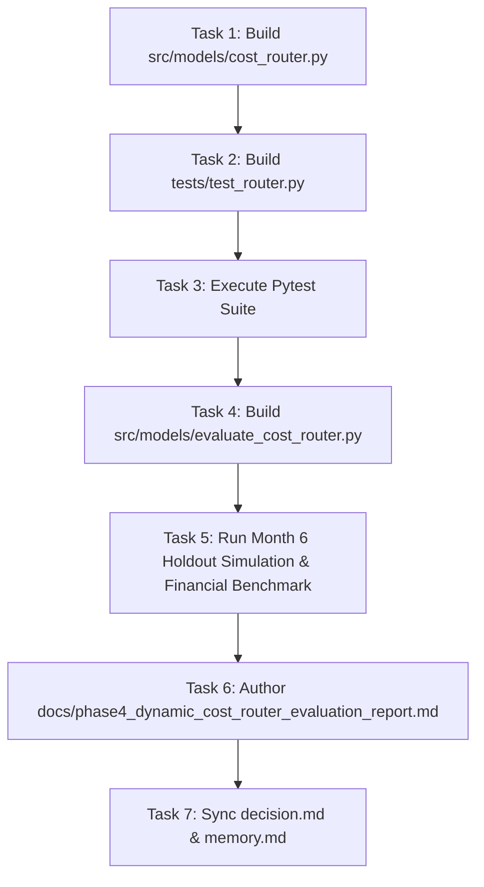

# Implementation Plan: Phase 4 Dynamic Transaction-Value Aware Cost Matrix Router

**Phase:** Phase 4 (Novelty #2: Dynamic Cost Router & Financial Optimization)  
**Status:** READY FOR EXECUTION  
**Branch:** `feature/phase4-dynamic-cost-router`  
**Dependencies:** Phase 3 Model Engine (`models/fraud_lgb_model.txt`, `src/models/dataset_loader.py`)  

---

## 1. Goal Description

Implement the **Dynamic Transaction-Value Aware Cost Matrix Router** (`src/models/cost_router.py`), replacing static probability cutoffs ($\tau = 0.50$) with a value-dependent dynamic decision threshold curve $\tau^*(\text{TransactionAmt})$ derived from Bayesian Decision Theory. 

Integrate an **EMV 3D-Secure 2.0 (3DS) Step-Up Challenge Resolution Model** (`APPROVE`, `STEP_UP_3DS`, `DECLINE`), execute a full comparative financial loss benchmark across the **92,453 holdout test transactions (Month 6)**, and verify mathematical integrity via targeted Pytest suites.

---

## 2. User Review & Architectural Alignments

> [!NOTE]
> All business cost parameters are calibrated to verified **2026 Payment Industry Benchmarks**:
> * **$C_{\text{chargeback}} = \$25.00$:** Non-refundable acquirer dispute fee.
> * **$\alpha = 2.0\%$:** Interchange fee loss on false declines.
> * **$C_{\text{friction}} = \$5.00$:** Customer support & lifetime value churn penalty.
> * **$C_{\text{step\_up}} = \$0.05$:** EMV 3DS 2.0 API authentication call cost.
> * **3DS Resolution Rates:** 85% authentication success for legitimate cardholders; 95% interception rate for fraud bots.

---

## 3. Proposed Changes & Implementation Tasks



---

### Task 1: Implement Dynamic Cost Router Module
**Target File:** `src/models/cost_router.py` [NEW]

* Implement `CostMatrixConfig` (Pydantic v2 configuration with defaults and validation).
* Implement `RoutingResult` (Pydantic response schema with action, probabilities, dynamic thresholds, expected costs, and latency).
* Implement `DynamicCostRouter`:
  * `compute_thresholds(amount: float) -> tuple[float, float]`
    $$\tau^*(\text{Amt}) = \frac{0.02 \cdot \text{Amt} + 5.00}{1.02 \cdot \text{Amt} + 30.00}$$
    $$\tau_{\text{step\_up}} = \text{clip}(\tau^*(\text{Amt}), 0.03, 0.25)$$
    $$\tau_{\text{decline}} = \text{clip}(4.0 \cdot \tau^*(\text{Amt}), 0.35, 0.80)$$

  * `route_transaction(fraud_prob: float, amount: float) -> RoutingResult` (sub-0.5ms single-transaction execution).
  * `batch_route_and_evaluate(fraud_probs: np.ndarray, amounts: np.ndarray, actual_labels: np.ndarray) -> dict` (vectorized NumPy batch calculation for hundreds of thousands of transactions).

---

### Task 2: Implement Targeted Pytest Suite
**Target File:** `tests/test_router.py` [NEW]

* **Test 1 (`test_monotonicity_with_amount`)**: Proves $\tau^*(A_1) > \tau^*(A_2)$ for $A_1 < A_2$.
* **Test 2 (`test_threshold_bounds_and_clamping`)**: Asserts $\tau_{\text{step\_up}} \in [0.03, 0.25]$ and $\tau_{\text{decline}} \in [0.35, 0.80]$ across edge-case amounts (\$0.01 to \$100,000).
* **Test 3 (`test_micro_vs_high_value_routing_behavior`)**: Asserts adaptive behavior (e.g. $p=0.10$ gets `APPROVE` on \$10, but `STEP_UP_3DS` on \$3,000).
* **Test 4 (`test_sub_millisecond_routing_latency`)**: Asserts execution latency strictly $< 1.0\text{ms}$.
* **Test 5 (`test_dynamic_router_financial_superiority`)**: Runs small vectorized sample to assert dynamic loss < static 0.50 loss.

---

### Task 3: Build & Execute Financial Benchmark Simulation
**Target File:** `src/models/evaluate_cost_router.py` [NEW]

* Loads production LightGBM booster (`models/fraud_lgb_model.txt`).
* Loads untouched **Month 6 Holdout Test Set ($92,453$ transactions)** via `get_temporal_splits()`.
* Evaluates 4 operational policies side-by-side:
  1. **Policy 1 (Naive Approve-All / No Fraud System):** $\text{Loss} = \sum_{y=1} (\text{Amt}_i + \$25.00)$
  2. **Policy 2 (Standard Static ML Cutoff $\tau = 0.50$):** Fixed 0.50 threshold.
  3. **Policy 3 (Tuned Static Global Cutoff $\tau = \tau_{\text{opt}}$):** Optimal single static threshold tuned on Month 5 validation.
  4. **Policy 4 (Dynamic Value-Aware Cost Router + 3DS):** Our value-dependent tri-state system.
* Computes:
  * Total Realized Financial Loss (\$)
  * Net Dollars Saved vs Static 0.50 (\$)
  * Cost Reduction ROI (%)
  * Legitimate Customer Friction Rate (%)
  * Chargeback Volume Ratio (%) vs Visa VAMP (1.5%) & Mastercard ECP (1.0%) compliance limits.

---

### Task 4: Comprehensive Evaluation Report & State Sync
* **Target File:** `docs/phase4_dynamic_cost_router_evaluation_report.md` [NEW]
* Document complete financial results, savings comparison tables, threshold distribution curves, and SLA latency metrics.
* Synchronize `decision.md` and `memory.md`.

---

## 4. Verification Plan

### Automated Tests
Run:
```powershell
.venv\Scripts\pytest.exe tests/test_router.py -v
.venv\Scripts\pytest.exe tests/ -v
```
* **Success Criteria:** 100% pass rate across all 15 tests in the repository.

### Simulation Verification
Run:
```powershell
.venv\Scripts\python.exe src/models/evaluate_cost_router.py
```
* **Success Criteria:** Outputs formatted 4-way comparison matrix demonstrating strictly positive dollar savings over static baselines and chargeback rate compliant with Visa/Mastercard standards.
