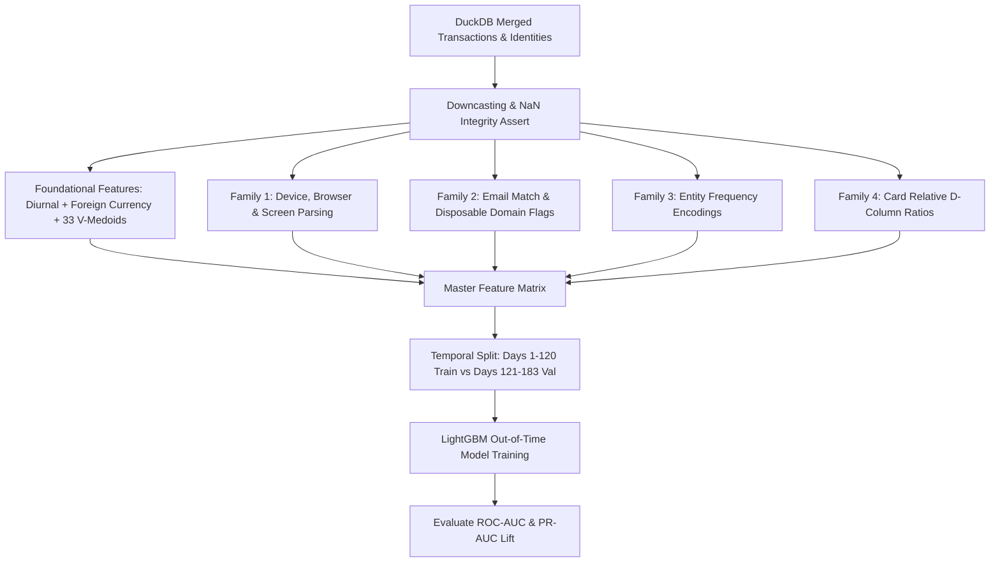

# Technical Design Specification: Exhaustive Domain Feature Engineering Suite (Phase 2 Upgrade)

**Document:** Exhaustive Feature Engineering Suite Design  
**Date:** August 15, 2026  
**Status:** In Review  
**Target File:** `notebooks/01_eda.ipynb`

---

## 1. Overview & Business Objectives

This specification defines the implementation of **Option 2: Exhaustive Domain Feature Suite** to upgrade our real-time fraud feature engineering pipeline. 

The objective is to enrich our foundational feature set (diurnal hour, foreign currency detection, dual-tier entity keys, and 33 $V$-medoids) with 4 high-impact domain feature families:
1. **Device & Browser Fingerprint Extraction** (`DeviceInfo`, `id_30`, `id_31`, `id_33`).
2. **Email & Identity Domain Compatibility** (`P_emaildomain` vs. `R_emaildomain`).
3. **Frequency & Card Velocity Encodings** (`card_base_id`, `cardholder_uid`, `addr1`).
4. **Normalized Temporal Delta Aggregations** ($D1$, $D2$, $D15$ scaled by card-level history).

---

## 2. Feature Schema & Engineering Logic

### Family 1: Device & Browser Fingerprint Parsing
* **`device_corp` (Categorical):** Parsed from `DeviceInfo` (e.g. `samsung`, `apple`, `microsoft`, `huawei`, `google_lg`, `motorola`, `other`, `missing`).
* **`browser_corp` (Categorical):** Parsed from `id_31` (e.g. `chrome`, `safari`, `firefox`, `edge`, `ie`, `opera`, `samsung_browser`, `other`, `missing`).
* **`os_family` (Categorical):** Parsed from `id_30` (e.g. `ios`, `android`, `windows`, `mac`, `linux`, `other`, `missing`).
* **`screen_aspect_ratio` (Float32):** Parsed from `id_33` (width $\div$ height). Missing values filled with `0.0`.

### Family 2: Email & Identity Domain Compatibility
* **`email_domain_match` (Integer):** 
  * `1` if `P_emaildomain == R_emaildomain` (and both are not null).
  * `0` if `P_emaildomain != R_emaildomain` (and both are not null).
  * `-1` if either `P_emaildomain` or `R_emaildomain` is null.
* **`is_disposable_email` (Binary):** `1` if `P_emaildomain` $\in$ (`mail.com`, `protonmail.com`, `anonymous.com`, `tutanota.com`), else `0`.

### Family 3: Frequency & Card Velocity Encodings
* **`card_base_id_freq` (Float32 / Int32):** Historical transaction count per universal card entity `card_base_id`.
* **`cardholder_uid_freq` (Float32 / Int32):** Historical transaction count per strict identity `cardholder_uid`.
* **`addr1_freq` (Float32 / Int32):** Frequency of transactions originating from billing region `addr1`.
* **`P_emaildomain_freq` (Float32 / Int32):** Frequency of transactions using purchaser domain `P_emaildomain`.

### Family 4: Relative Card Temporal Deltas ($D$-Columns)
* **`D1_to_mean_card` (Float32):** $D1 \div (\text{mean}(D1 \text{ per card}) + 10^{-5})$.
* **`D2_to_mean_card` (Float32):** $D2 \div (\text{mean}(D2 \text{ per card}) + 10^{-5})$.
* **`D15_to_mean_card` (Float32):** $D15 \div (\text{mean}(D15 \text{ per card}) + 10^{-5})$.

---

## 3. Architecture & Data Flow

---

## 4. Verification & Validation Plan

1. **Deterministic Transform Testing:** Run vector operations on full dataset to confirm zero NaN generation on non-null inputs.
2. **Top-to-Bottom Execution:** Execute `notebooks/01_eda.ipynb` via `jupyter nbconvert` on full 590,540 rows.
3. **Model Benchmark Comparison:** Compare new Out-of-Time metrics against the prior baseline:
   * Target: Maintain/Improve **ROC-AUC $\ge 0.8881$** and **PR-AUC $\ge 0.4815$**.
4. **Feast Readiness:** Confirm all engineered features have clean schema definitions suitable for Phase 3 Feast offline & online store registration.
