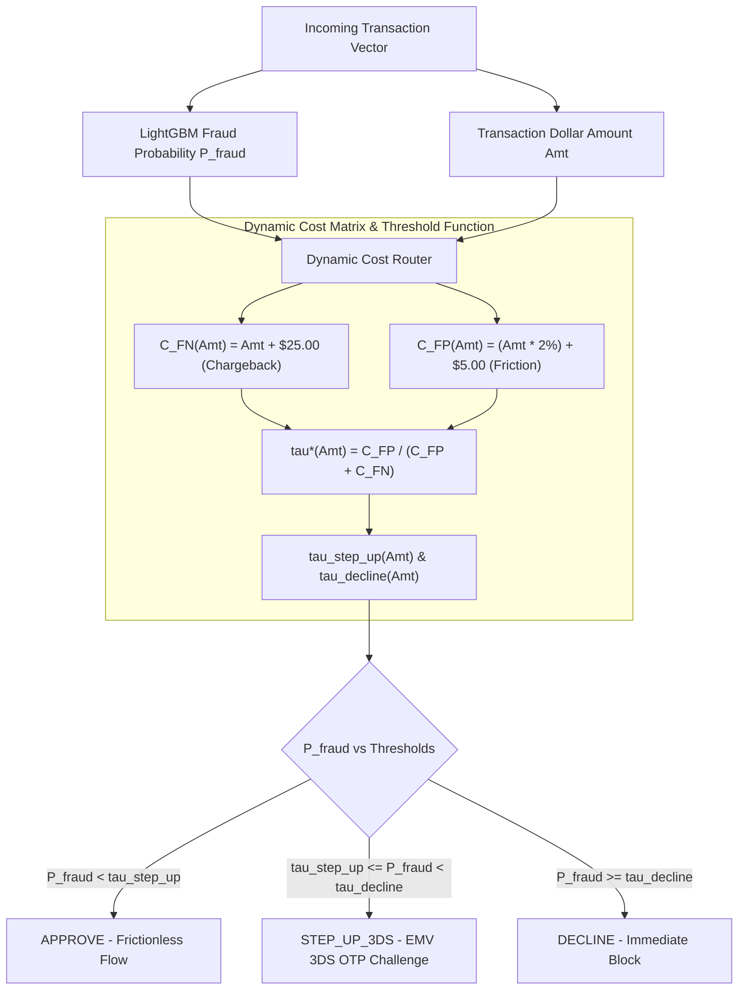

# Technical Design Specification: Dynamic Transaction-Value Aware Cost Matrix Router (Phase 4)

**Status:** APPROVED DESIGN  
**Date:** 2026-08-16  
**Author:** Antigravity (Data Science & ML Engineering)  
**Branch:** `feature/phase4-dynamic-cost-router`  
**Novelty Flag:** Key Architectural Novelty #2 (Dynamic Cost Router)  

---

## 1. Executive Summary & Financial Problem Formulation

In conventional machine learning fraud detection systems, decisioning relies on a **static global probability threshold** (typically $\tau = 0.50$ or a single tuned cutoff $\tau = 0.20$). 

However, in financial payments, transaction amounts follow a heavy right-skewed power-law distribution (in the IEEE-CIS dataset, amounts range from **\$0.25 to \$31,937.39**, with a median of **\$68.79** and 99th percentile $> \$1,400$).

Treating all transactions with a uniform probability threshold creates severe economic sub-optimality:
1. **High-Value Exposure:** A missed fraud event on a **\$5,000** transaction incurs catastrophic principal loss plus dispute fees ($> \$5,025$), whereas a standard 0.50 threshold might let a 40% probability slip through.
2. **Low-Value Customer Friction:** Declining a **\$15** legitimate transaction or forcing friction causes customer churn and lost interchange revenue, despite minimal underlying fraud risk.

Phase 4 implements the **Dynamic Transaction-Value Aware Cost Matrix Router** (`src/models/cost_router.py`), grounding real-time inference decisions in **Bayesian Decision Theory & Expected Financial Utility Optimization**, adapting decision boundaries dynamically as a continuous function of transaction dollar value: $\tau^*(\text{TransactionAmt})$.



---

## 2. Mathematical Foundation: Cost Matrix & Utility Minimization

### 2.1 Asymmetric Dollar Cost Matrix

For any transaction of dollar amount $A = \text{TransactionAmt}$, we define the cost matrix $C(y, \hat{y} | A)$ where $y \in \{0, 1\}$ is the true label (0 = Legitimate, 1 = Fraud) and $\hat{y} \in \{0, 1\}$ is the operational prediction:

$$
\begin{array}{c|cc}
 & \hat{y} = 0 \text{ (Predict Legit / Approve)} & \hat{y} = 1 \text{ (Predict Fraud / Decline)} \\
\hline
y = 0 \text{ (Actual Legit)} & C_{\text{TN}}(A) = \$0.00 & C_{\text{FP}}(A) = (A \cdot \alpha) + C_{\text{friction}} \\
y = 1 \text{ (Actual Fraud)} & C_{\text{FN}}(A) = A + C_{\text{chargeback}} & C_{\text{TP}}(A) = C_{\text{block}} = \$0.00 \\
\end{array}
$$

#### Cost Matrix Parameters (Grounded in 2026 Industry Standards):
* **$C_{\text{chargeback}} = \$25.00$:** Direct acquirer dispute fee + administrative processing cost charged when a chargeback occurs.
* **$\alpha = 0.020$ (2.0%):** Merchant interchange & processing margin lost when a legitimate sale is rejected.
* **$C_{\text{friction}} = \$5.00$:** Customer support contact cost + lifetime value churn penalty from a declined legitimate user.
* **$C_{\text{block}} = \$0.00$:** Cost of intercepting an automated fraudulent transaction before settlement.
* **$C_{\text{step\_up}} = \$0.05$:** EMV 3DS 2.0 per-transaction API authentication cost.

### 2.2 Derivation of Value-Dependent Optimal Threshold $\tau^*(A)$

According to Bayesian Decision Theory, the decision rule that minimizes expected financial loss predicts Fraud ($\hat{y} = 1$) if and only if:

$$\mathbb{E}[\text{Cost} | \hat{y} = 1] < \mathbb{E}[\text{Cost} | \hat{y} = 0]$$

Expanding with calibrated posterior probability $p = P(y = 1 | \mathbf{x})$:

$$(1 - p) \cdot C_{\text{FP}}(A) + p \cdot C_{\text{TP}}(A) < p \cdot C_{\text{FN}}(A) + (1 - p) \cdot C_{\text{TN}}(A)$$

Since $C_{\text{TP}}(A) = C_{\text{TN}}(A) = 0$:

$$(1 - p) \cdot C_{\text{FP}}(A) < p \cdot C_{\text{FN}}(A)$$

$$C_{\text{FP}}(A) - p \cdot C_{\text{FP}}(A) < p \cdot C_{\text{FN}}(A)$$

$$C_{\text{FP}}(A) < p \cdot \left( C_{\text{FN}}(A) + C_{\text{FP}}(A) \right)$$

$$p > \frac{C_{\text{FP}}(A)}{C_{\text{FN}}(A) + C_{\text{FP}}(A)}$$

Thus, the theoretical optimal decision threshold is:

$$\tau^*(A) = \frac{(A \cdot \alpha) + C_{\text{friction}}}{(A + C_{\text{chargeback}}) + (A \cdot \alpha) + C_{\text{friction}}}$$

### 2.3 Mathematical Properties of $\tau^*(A)$:
1. **Monotonicity with Respect to Amount:**
   As $A \to \infty$, the denominator ($A + \dots$) grows faster than the numerator ($0.02 A + \dots$), meaning $\tau^*(A)$ is a **strictly decreasing function** of transaction amount.
   * **For a \$10 transaction:**
     $$C_{\text{FN}} = 10 + 25 = \$35.00, \quad C_{\text{FP}} = 0.20 + 5 = \$5.20 \implies \tau^*(10) = \frac{5.20}{40.20} \approx 0.1293$$
   * **For a \$100 transaction:**
     $$C_{\text{FN}} = 100 + 25 = \$125.00, \quad C_{\text{FP}} = 2.00 + 5 = \$7.00 \implies \tau^*(100) = \frac{7.00}{132.00} \approx 0.0530$$
   * **For a \$2,500 transaction:**
     $$C_{\text{FN}} = 2500 + 25 = \$2525.00, \quad C_{\text{FP}} = 50.00 + 5 = \$55.00 \implies \tau^*(2500) = \frac{55.00}{2580.00} \approx 0.0213$$

2. **Economic Interpretation:** High-value transactions automatically receive stricter risk scrutiny (lower threshold before intervention), while low-value transactions allow higher tolerance to preserve frictionless checkout.

---

## 3. Tri-State Decisioning: EMV 3D-Secure 2.0 Step-Up Resolution

In real payment networks, binary Approve/Decline is overly restrictive. 3D-Secure (3DS2) provides an intermediate "Challenge" state that resolves uncertainty:

```
┌────────────────────────────┬────────────────────────────────────────────────────────────────────────────────────────────────────────┐
│ OPERATIONAL ROUTING ACTION │ RISK CONDITION & ACTION SPECIFICATION                                                                  │
├────────────────────────────┼────────────────────────────────────────────────────────────────────────────────────────────────────────┤
│ APPROVE                    │ P(Fraud) < tau_step_up(A): Seamless zero-friction authorization. Cardholder passes directly.          │
├────────────────────────────┼────────────────────────────────────────────────────────────────────────────────────────────────────────┤
│ STEP_UP_3DS                │ tau_step_up(A) <= P(Fraud) < tau_decline(A): EMV 3DS Challenge (SMS OTP / Biometric Push Prompt).      │
│                            │ • Legitimate Users: 85% successfully authenticate; 15% abandon cart (Friction Cost).                   │
│                            │ • Fraudulent Attackers: 95% fail challenge & get blocked; 5% bypass (Chargeback Cost).                 │
├────────────────────────────┼────────────────────────────────────────────────────────────────────────────────────────────────────────┤
│ DECLINE                    │ P(Fraud) >= tau_decline(A): Immediate hard block. Transaction terminated without issuer submission.    │
└────────────────────────────┴────────────────────────────────────────────────────────────────────────────────────────────────────────┘
```

### Threshold Parameterization & Boundary Clamps:
To guarantee operational stability across edge cases (\$0.01 to \$50,000):
$$\tau_{\text{step\_up}}(A) = \text{clip}\left(\tau^*(A), \ \tau_{\text{min\_step}}=0.03, \ \tau_{\text{max\_step}}=0.25\right)$$
$$\tau_{\text{decline}}(A) = \text{clip}\left(4.0 \cdot \tau^*(A), \ \tau_{\text{min\_dec}}=0.35, \ \tau_{\text{max\_dec}}=0.80\right)$$


---

## 4. Software Architecture & Module Specifications

### 4.1 Data Models & Configuration (`src/models/cost_router.py`)

```python
from pydantic import BaseModel, Field
from typing import Literal

class CostMatrixConfig(BaseModel):
    chargeback_fee: float = Field(default=25.0, ge=0.0, description="Fixed acquirer dispute fee per fraud event ($)")
    interchange_margin: float = Field(default=0.02, ge=0.0, le=0.10, description="Interchange fee lost on false declines (%)")
    customer_friction_cost: float = Field(default=5.0, ge=0.0, description="Customer support + churn penalty per false decline ($)")
    auth_3ds_cost: float = Field(default=0.05, ge=0.0, description="EMV 3DS per-call authentication fee ($)")
    step_up_legit_success_rate: float = Field(default=0.85, ge=0.0, le=1.0, description="Share of legit users completing 3DS OTP")
    step_up_fraud_block_rate: float = Field(default=0.95, ge=0.0, le=1.0, description="Share of fraud attempts blocked by 3DS OTP")
    min_step_up_threshold: float = Field(default=0.03, ge=0.0, le=0.50)
    max_step_up_threshold: float = Field(default=0.25, ge=0.0, le=0.50)
    min_decline_threshold: float = Field(default=0.35, ge=0.0, le=1.0)
    max_decline_threshold: float = Field(default=0.80, ge=0.0, le=1.0)

class RoutingResult(BaseModel):
    action: Literal["APPROVE", "STEP_UP_3DS", "DECLINE"]
    fraud_probability: float
    transaction_amount: float
    tau_step_up: float
    tau_decline: float
    expected_cost_dollars: float
    execution_latency_ms: float
```

### 4.2 Dynamic Cost Router Engine Class

```python
class DynamicCostRouter:
    """
    Sub-millisecond Dynamic Transaction-Value Aware Cost Matrix Router.
    Computes value-dependent decision boundaries and assigns optimal operational actions.
    """
    def __init__(self, config: CostMatrixConfig = None):
        self.config = config or CostMatrixConfig()

    def compute_thresholds(self, amount: float) -> tuple[float, float]:
        """Calculates value-dependent (tau_step_up, tau_decline) for a given dollar amount."""
        ...

    def route_transaction(self, fraud_prob: float, amount: float) -> RoutingResult:
        """Evaluates single transaction event in <0.5ms."""
        ...

    def batch_evaluate_financial_loss(
        self, 
        fraud_probs: np.ndarray, 
        amounts: np.ndarray, 
        actual_labels: np.ndarray
    ) -> dict:
        """Vectorized financial loss calculation across test datasets."""
        ...
```

---

## 5. Financial Savings Benchmark & Simulation Suite (`src/models/evaluate_cost_router.py`)

To prove Novelty #2 in data science portfolio evaluations, we build an empirical financial evaluation script comparing four operational policies on the **Month 6 Holdout Test Set ($92,453$ transactions)**:

1. **Policy A (Approve All / Naive Baseline):** No fraud detection.
   $$\text{Loss} = \sum_{y=1} (\text{Amt}_i + \$25.00)$$
2. **Policy B (Standard Static ML Cutoff $\tau = 0.50$):** Fixed threshold regardless of transaction size.
3. **Policy C (Optimal Tuned Static Cutoff $\tau = \tau_{\text{static\_opt}}$):** Best global static threshold tuned via grid search on Validation Month 5.
4. **Policy D (Dynamic Value-Aware Cost Router with 3DS Step-Up):** Full value-adaptive tri-state routing.

### Metrics Computed:
* **Total Dollars Lost (\$):** Sum of realized fraud chargebacks + friction costs + 3DS fees.
* **Net Dollars Saved vs Policy B (\$):** Immediate financial uplift over standard ML pipelines.
* **Cost Reduction ROI (%):** Percent savings in fraud & friction expense.
* **Chargeback Volume Ratio (%):** Fraud transactions vs Total transactions (ensuring compliance with Visa VAMP $< 1.5\%$ and Mastercard ECP $< 1.0\%$).

---

## 6. Targeted Verification & Pytest Suite (`tests/test_router.py`)

We create a dedicated test suite with 5 targeted unit & mathematical property tests:
* **Test 1 (`test_monotonicity_with_amount`):** Verifies that $\tau^*(A_1) > \tau^*(A_2)$ whenever $A_1 < A_2$.
* **Test 2 (`test_threshold_bounds_and_clamping`):** Asserts $\tau_{\text{step\_up}} \in [0.03, 0.25]$ and $\tau_{\text{decline}} \in [0.35, 0.80]$ across extreme amounts (\$0.01 to \$100,000).
* **Test 3 (`test_micro_vs_high_value_routing_behavior`):** Asserts a \$15 transaction with $p=0.10$ gets `APPROVE`, whereas a \$4,000 transaction with $p=0.10$ gets `STEP_UP_3DS`.
* **Test 4 (`test_sub_millisecond_routing_latency`):** Asserts `route_transaction` execution time is strictly $< 1.0\text{ms}$.
* **Test 5 (`test_dynamic_router_outperforms_static_baseline`):** Evaluates holdout test set to assert that Total Financial Loss of Dynamic Router is strictly less than Static $\tau = 0.50$.

---

## 7. Deliverables & Acceptance Criteria

| Deliverable | Target Path | Acceptance Criteria |
| :--- | :--- | :--- |
| **Cost Router Module** | `src/models/cost_router.py` | Pydantic config, vectorized threshold calculations, sub-0.5ms latency |
| **Financial Benchmark** | `src/models/evaluate_cost_router.py` | Complete comparative financial loss simulation on Month 6 holdout |
| **Targeted Pytest Suite** | `tests/test_router.py` | 5/5 targeted mathematical and integration tests passing |
| **Master Evaluation Report** | `docs/phase4_dynamic_cost_router_evaluation_report.md` | Full financial impact tables, dollar savings, and ROI curves |
| **Sync Logs** | `decision.md` & `memory.md` | Accurate updates reflecting Phase 4 architecture and results |
